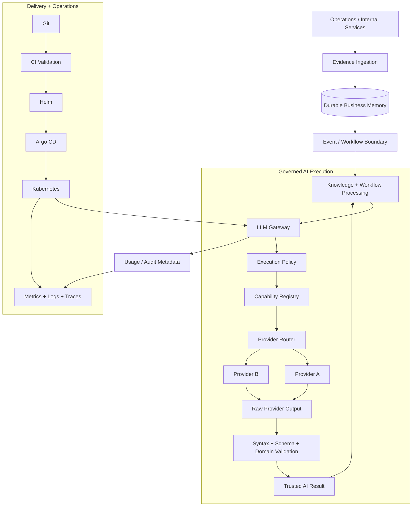
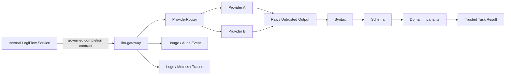
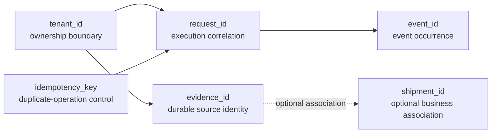
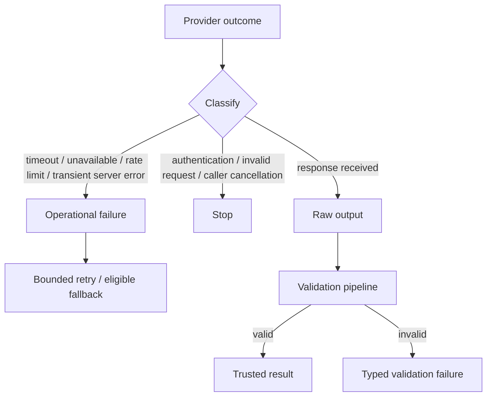
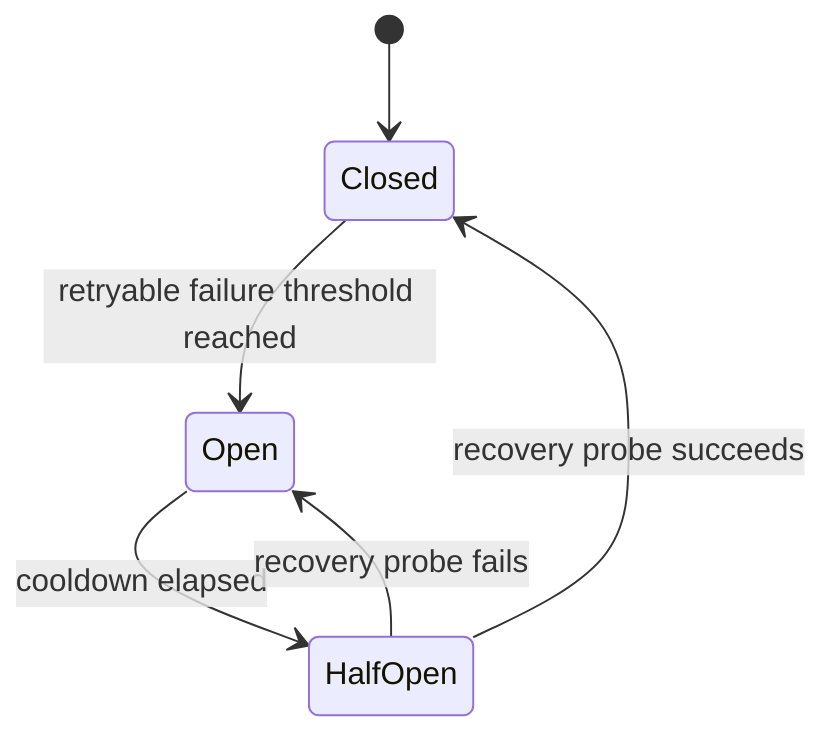
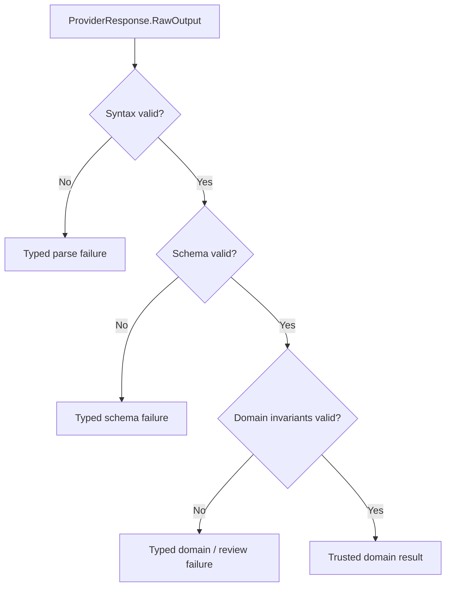
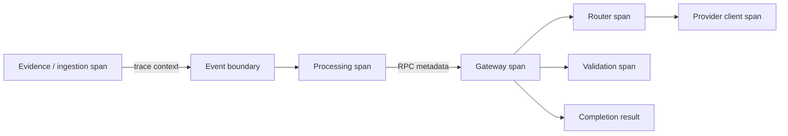
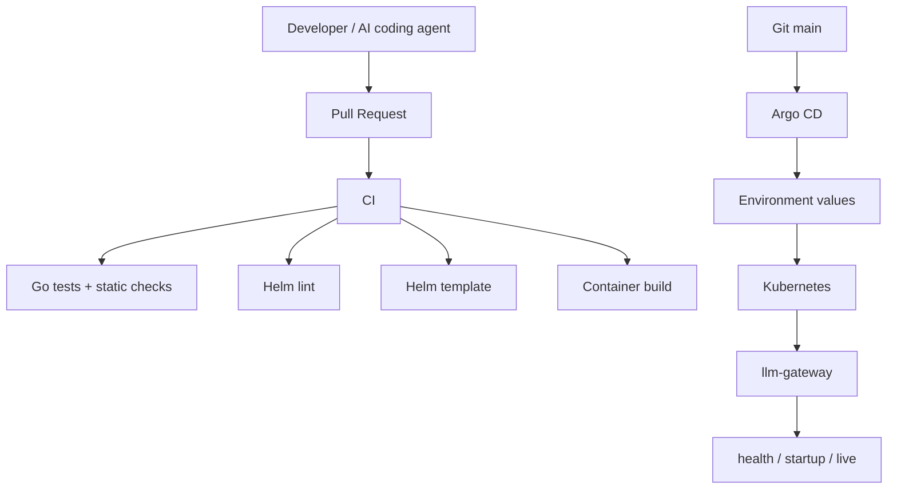
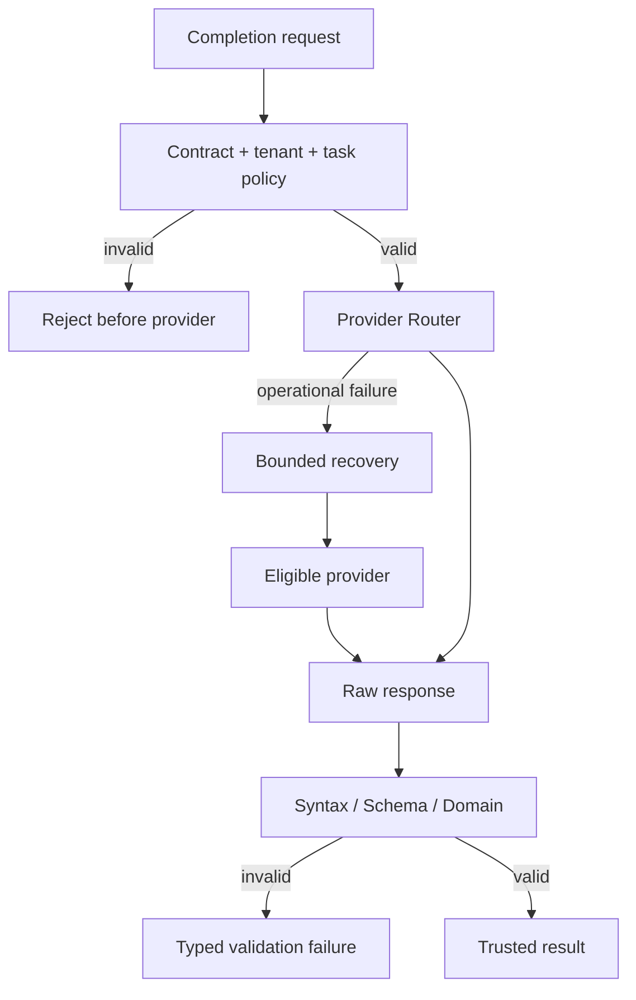

# LogiFlow — AI-Powered Operational Intelligence Platform

[](https://go.dev/)
[](https://kubernetes.io/)
[](https://helm.sh/)
[](https://argo-cd.readthedocs.io/)
[](LICENSE)

> **LogiFlow is a multi-tenant AI engineering platform for logistics operations, built around durable business evidence, governed LLM execution, deterministic validation, resilient provider access, Kubernetes delivery, and operational observability.**

The project is designed to demonstrate how a backend/platform engineer can take an AI capability from a business requirement to a controlled runtime boundary: define the domain, isolate vendors, validate probabilistic output, preserve tenant identity, contain provider failure, expose operational signals, and deliver the service through a repeatable Kubernetes/GitOps path.

---

## 0. Current Status: What Exists vs. What Is Target Architecture

LogiFlow follows a **deploy-first** progression: the runtime boundary is established first, then AI execution capabilities are added behind explicit contracts. This document deliberately distinguishes implemented evidence from architectural targets so the repository does not claim capabilities that are still planned.

### Implemented evidence

- Go composition root at `cmd/llm-gateway/main.go`.
- HTTP server listening on `PORT` with a default of `8080`.
- `GET /healthz`, `GET /startupz`, and `GET /live` health endpoints.
- Graceful shutdown on `SIGINT` and `SIGTERM`.
- Multi-stage container build at `build/Dockerfile.llm-gateway`.
- Helm deployment with platform security context, resources, and probes.
- Development, staging, and production configuration overlays.
- DDD service structure for domain, application, interfaces, and infrastructure boundaries.
- Typed gateway failure categories and cancellation/deadline handling.
- Syntax → schema → domain validation and explicit refusal of invalid model output.
- Execution metadata with decomposed provider, validation, and total latency measurements.
- Local Kubernetes smoke-test and deployment-runbook evidence.
- Internal traffic strategy based on Kubernetes `ClusterIP`, with future L7 exposure deliberately deferred.

### Target architecture

The following remain architectural targets unless explicitly implemented in the service code and deployment manifests:

- gRPC completion contract and generated client/server bindings.
- Concrete OpenAI, Gemini, Anthropic, or other provider adapters.
- Redis-backed tenant budgets, distributed rate limiting, and tenant-scoped semantic caching.
- Provider-scoped circuit breakers, bounded retries, provider fallback, and provider pools.
- Kafka `UsageCostEvent` / `AIUsageEvent` publication and downstream billing reconciliation.
- W3C trace propagation across Kafka and gRPC boundaries.
- Full provider contract tests, Redis atomic-operation integration tests, load tests, and failure-injection suites.

The architecture below documents these target contracts because they define the direction of the platform; implementation status remains explicit so planned behavior is not mistaken for shipped runtime behavior.

## 1. The Business Problem

Logistics teams operate across fragmented evidence: shipment events, delay notices, customer messages, carrier communication, invoices, customs documents, internal notes, and operational reports.

The difficult problem is not simply **calling an LLM**. The difficult problem is allowing AI to participate in an operational workflow without losing control of:

- tenant boundaries;
- evidence ownership and provenance;
- model/provider coupling;
- invalid or unsafe model output;
- provider outages and timeouts;
- token consumption and cost attribution;
- request deadlines and cancellation;
- deployment and rollback;
- incident diagnosis and auditability.

LogiFlow addresses that problem by separating **business memory** from **AI execution**.

```text
                         LOGIFLOW

        BUSINESS MEMORY                         AI EXECUTION
  ─────────────────────────────       ─────────────────────────────
  operational events                  governed AI requests
  documents                           task contracts
  evidence metadata                   provider isolation
  shipment associations               retry / timeout / fallback
  tenant ownership                    output validation
  source provenance                   usage metadata
  durable state                       operational telemetry

             │                                      │
             └──────────────┬───────────────────────┘
                            │
                            ▼
                 Operational Intelligence
```

The separation is deliberate: durable evidence is a business asset, while model execution is a controlled computation against that asset.

---

## 2. Engineering Principles

### Trust is explicit

A provider response is never treated as business truth simply because the provider returned successfully.

```text
raw provider output
       │
       ▼
syntax validation
       │
       ▼
schema validation
       │
       ▼
domain validation
       │
       ▼
trusted result
```

### Identity is explicit

The platform does not overload a generic `id` field with different meanings.

| Identifier        | Meaning                        | Security / operational role    |
| ----------------- | ------------------------------ | ------------------------------ |
| `tenant_id`       | data owner / security boundary | authorization, isolation       |
| `evidence_id`     | durable evidence identity      | provenance, retrieval, audit   |
| `shipment_id`     | optional business association  | shipment-specific reasoning    |
| `request_id`      | one execution correlation      | tracing, diagnostics           |
| `idempotency_key` | one logical operation          | duplicate protection           |
| `event_id`        | one event occurrence           | event identity / deduplication |

`shipment_id` is intentionally not universal. Evidence can exist at tenant level, become associated with a shipment later, or represent a multi-shipment context.

### The application contract is smaller than the vendor contract

The gateway application owns the stable use-case vocabulary. Provider adapters receive only the provider-facing subset they need.

```text
CompleteCommand
      │
      ├── tenant_id
      ├── request_id
      ├── task_type
      ├── prompt/version information
      ├── subjects
      ├── evidence references
      ├── deadline
      └── idempotency context
               │
               ▼
        ProviderRequest
               │
               ├── task type
               ├── prompt
               ├── prompt version
               ├── output schema version
               └── generation limits
```

Sensitive/internal execution metadata is not accidentally passed through to provider SDK payloads.

### Reliability must not create business truth

Provider routing answers:

> How should an external dependency be called safely?

Domain policy answers:

> Is this operation or result acceptable for the business?

Those responsibilities remain separate.

### Evidence before interpretation

Raw evidence belongs to the business memory side of the system. AI analysis consumes evidence references; it does not become the source of record for the underlying operational fact.

---

## 3. Platform Architecture



The platform is intentionally layered:

1. **Business memory** stores operational truth.
2. **Processing/workflows** transform and retrieve evidence.
3. **LLM Gateway** governs model execution.
4. **Validation** promotes only acceptable output to trusted application data.
5. **Telemetry** makes execution diagnosable.
6. **CI/GitOps/Kubernetes** make the runtime repeatable and recoverable.

---

## 4. The LLM Gateway

The LLM Gateway is a dedicated bounded context for **controlled, safe, and cost-aware AI execution**.

It exists between internal LogiFlow services and external model providers.



### What the gateway owns

- governed completion requests;
- tenant and execution metadata;
- capability selection through controlled `TaskType` values;
- prompt and schema version metadata;
- provider abstraction;
- provider routing and bounded recovery behavior;
- request deadline propagation;
- syntax/schema/domain output trust promotion;
- typed failure semantics;
- execution metadata and usage facts;
- safe operational telemetry.

### What the gateway does not own

- the durable source of operational evidence;
- logistics business records;
- shipment storage;
- document persistence;
- retrieval/indexing internals;
- the financial billing ledger;
- workflow state owned by a workflow engine;
- provider credentials exposed to upstream callers.

Those boundaries keep the gateway focused instead of turning it into a general-purpose logistics service.

### Why a Dedicated Gateway Instead of a Shared LLM Client Library?

A shared Go client library would make the first integration simple, but it would distribute runtime policy across every consumer. The dedicated gateway keeps the AI execution boundary independently deployable and independently scalable.

| Concern            | Dedicated `llm-gateway`                                    | Shared client library                                       |
| ------------------ | ---------------------------------------------------------- | ----------------------------------------------------------- |
| Deployment         | Provider policy changes without rebuilding every caller    | Every importing service must rebuild and coordinate rollout |
| Runtime isolation  | Slow provider calls are isolated from business services    | AI latency consumes caller resources directly               |
| Cost control       | One tenant budget and rate policy                          | Potentially divergent implementations                       |
| Provider migration | Switch adapters behind one contract                        | Update every consumer                                       |
| Failure handling   | One place for timeout, retry, breaker, and fallback policy | Repeated resilience implementations                         |
| Scaling            | AI execution scales independently                          | Caller and AI capacity are coupled                          |
| Trade-off          | Adds an internal network hop                               | Lower local-call overhead                                   |

The platform accepts the internal network hop because the gateway is a **policy and trust boundary**, not merely a convenience wrapper around an SDK.

---

## 5. Request Identity Model

The request path uses explicit identities because each identifier represents a different lifecycle.



### Why this matters

A request may analyze one shipment, several shipments, tenant-level evidence, or evidence with no shipment association. A request ID cannot become a durable evidence identity, and an event ID cannot become an idempotency key.

The explicit vocabulary prevents entire classes of subtle authorization, caching, audit, and correlation bugs.

---

## 6. Application Contract

The core use case is transport-neutral and capability-controlled.

```go
type CompleteCommand struct {
    ContractVersion      string
    TenantID             string
    RequestID            string
    IdempotencyKey       string
    TaskType             TaskType
    TaskSchemaVersion    string
    Prompt               string
    PromptVersion        string
    OutputSchemaVersion  string
    MaxTokens            int
    Deadline              time.Time
    Subjects             []EntityReference
    EvidenceRefs         []EvidenceReference
}
```

The exact implementation remains the authority, but the architectural rules are stable:

- callers identify the tenant;
- requests are correlated explicitly;
- capabilities are selected using controlled task types;
- schema and prompt provenance are part of execution metadata;
- evidence references are explicit;
- deadlines are bounded;
- provider adapters receive a narrowed provider request;
- unsupported work is rejected before provider spending.

---

## 7. Capability Boundary

The first governed business capability is shipment delay risk.

The registry separates capability dispatch from provider logic.

```text
TaskRegistry
    │
    └── shipment_delay_risk
            │
            ├── request validation
            ├── provider request construction
            ├── raw output decoding
            └── domain validation
```

This avoids a giant switch statement and keeps additional capabilities independent from vendor-specific code.

Examples of capability types that fit the same architecture are document summarization, invoice extraction, customs-policy analysis, message classification, and other controlled business tasks.

---

## 8. Provider Isolation And Reliability

The provider boundary is an anti-corruption layer.

```text
Application
    │
    ▼
Provider interface
    │
    ▼
ProviderRouter
    ├── Provider A
    ├── Provider B
    └── Provider C
```

The router preserves the application contract while composing concrete providers behind it.

### Recovery classification



The router does not validate shipment-risk semantics. The task/application validation path owns that responsibility.

### Retry and fallback rules

- retries are bounded;
- only classified operational failures are retry candidates;
- caller cancellation is terminal;
- caller deadline exhaustion is terminal;
- authentication failures are not healed by repeated calls;
- malformed business output is not automatically treated as provider unavailability;
- provider order is deterministic;
- the parent context is authoritative;
- attempt timeouts can shorten a request but cannot extend it.

---

### Provider-Scoped Circuit Breaking

Circuit breaking belongs to provider reliability, not the domain model. Each provider should have an independent health state so an outage in one external dependency does not suppress healthy capacity elsewhere.



A breaker policy is implementation-specific, but the architectural invariants are stable: it must be provider-scoped, bounded, observable, and compatible with the parent request deadline. Fallback remains eligible only for failures classified as operational.

## 9. Trust Pipeline

The gateway treats external AI output as untrusted data.



For shipment-risk output, domain validation includes rules such as:

```text
0.0 <= confidence <= 1.0
high_risk requires non-empty reasons
result shipment_id matches the requested subject
risk is a controlled value
confidence is finite
```

No silent repair is allowed.

A value such as `1.7` is rejected rather than clamped to `1.0`. A missing reason is rejected rather than invented.

That keeps model degradation visible and measurable.

---

## 10. Usage And Audit Metadata

The gateway records execution facts separately from model content.

```text
AIUsageEvent
    ├── event_id
    ├── event_version
    ├── tenant_id
    ├── request_id
    ├── task_type
    ├── provider
    ├── model
    ├── input_tokens
    ├── output_tokens
    ├── total_tokens
    ├── estimated_cost_usd
    ├── execution_status
    ├── validation_status
    └── occurred_at
```

The event excludes:

```text
raw prompt
full completion
full document contents
retrieved chunks
credentials
secrets
```

The domain models the business fact; an application publisher port owns delivery mechanics.

This separation keeps domain code independent from Kafka, databases, brokers, or vendor SDKs.

---

### Usage Accounting and Financial Ownership

The gateway should publish execution facts rather than write the financial ledger synchronously.

```text
completion request
      │
      ├── low-latency execution controls → Redis / shared state
      │
      └── provider execution
                │
                ▼
          AIUsageEvent
                │
                ▼
              Kafka
                │
                ▼
          billing service
                │
                ▼
       PostgreSQL ledger
```

This is a **write-behind** accounting boundary. It keeps the hot path responsive while preserving a replayable event stream for reconciliation. The trade-off is eventual consistency and a requirement for durable publication/reconciliation; asynchronous best-effort publication alone is not an exactly-once financial guarantee.

The event must remain metadata-oriented and must not become a second copy of prompts, documents, retrieved chunks, credentials, or secrets.

## 11. LLM Observability

A useful AI system needs more than application error counts.

```text
request
  │
  ├── request_id
  ├── tenant-safe correlation
  ├── task_type
  ├── prompt_version
  ├── provider
  ├── model
  ├── provider latency
  ├── validation latency
  ├── total gateway latency
  ├── token usage
  ├── estimated cost
  ├── retry/fallback outcome
  └── final status
```

### Signal ownership

| Signal      | Answers                                       |
| ----------- | --------------------------------------------- |
| Log         | What happened in this execution?              |
| Metric      | How often / how much / how severe?            |
| Trace       | Where did time and failure travel?            |
| Usage event | What billable/auditable AI activity occurred? |

### Core metric families

```text
llm_gateway_requests_total
llm_gateway_request_duration_seconds
llm_gateway_provider_requests_total
llm_gateway_provider_latency_seconds
llm_gateway_provider_failures_total
llm_gateway_fallback_total
llm_gateway_validation_failures_total
llm_gateway_budget_denied_total
llm_gateway_cache_hits_total
llm_gateway_estimated_cost_usd_total
```

Prometheus label dimensions remain low-cardinality. Provider, model, task type, status, and failure class are appropriate operational dimensions; request IDs, tenant IDs, prompts, and evidence content belong in correlation mechanisms rather than unbounded metric labels. Prometheus recommends meaningful labels while warning that every unique label combination creates a new time series and high-cardinality dimensions should not be used as labels. citeturn922623search0turn922623search15

OpenTelemetry semantic conventions provide a common vocabulary for traces, metrics, logs, events, and resources, which supports consistent cross-service diagnosis. citeturn922623search1turn922623search2

---

## 12. Distributed Tracing Model



The important correlation path is:

```text
W3C trace context
    ↓
service boundary
    ↓
request_id
    ↓
provider attempt
    ↓
validation
    ↓
final result
```

OpenTelemetry defines semantic conventions specifically to make operations across traces, logs, metrics, and resources consistently named and correlated across polyglot systems. citeturn922623search2turn922623search13

Sensitive payloads remain opt-in and minimized; prompts and evidence contents are not default telemetry fields.

---

### Cross-Service Trace Propagation

The target distributed trace follows the evidence-to-AI path without copying sensitive payloads:

```text
stream-ingestion
      │
      │ trace context in Kafka headers
      ▼
knowledge-pipeline
      │
      │ trace context in gRPC metadata
      ▼
llm-gateway
      │
      ├── provider child span
      └── validation span
```

The request should retain `request_id` as an operational correlation key while W3C trace context carries distributed causal context. Tenant identity can participate in authorization and controlled correlation, but high-cardinality identifiers should not be promoted into ordinary Prometheus labels.

## 13. Kubernetes And DevOps Architecture

LogiFlow uses a deploy-first service model.



### Runtime properties

- containerized Go service;
- non-root execution;
- read-only root filesystem;
- dropped Linux capabilities;
- seccomp `RuntimeDefault`;
- explicit resource requests/limits;
- startup, readiness, and liveness probes;
- environment-specific Helm values;
- Git-driven Argo CD deployment structure.

Argo CD supports declarative application definitions through Kubernetes manifests, keeping deployment configuration under version control and reconcilable by the controller. citeturn922623search14

Kubernetes `NetworkPolicy` provides the isolation mechanism for defining which pods may communicate with which peers; service-level policies belong at the deployment boundary, not inside domain code.

---

## 14. GitOps Release Model

```text
Git commit
   │
   ▼
CI validation
   │
   ▼
merged desired state
   │
   ▼
Argo CD
   │
   ▼
Helm rendering
   │
   ▼
Kubernetes reconciliation
   │
   ▼
ready pods
```

Operational discipline:

- Git is the desired-state source;
- CI checks repository correctness before promotion;
- Argo CD reconciles desired and live state;
- manual production edits are drift, not the deployment source of truth;
- rollback is a Git change, followed by reconciliation;
- secrets are referenced by deployment mechanisms and are not committed as plaintext application configuration.

---

## 15. Security Model

The security model is based on defense in depth.

### Tenant isolation

`tenant_id` is mandatory at the governed AI execution boundary. Every downstream tenant-sensitive decision uses this identity rather than inferring ownership from a shipment ID.

### Provider credential isolation

Upstream services never receive provider API keys. Provider credentials belong to the gateway's deployment/infrastructure boundary.

### Prompt / evidence privacy

Prompts, completions, raw documents, and retrieved content are treated as sensitive data and are not emitted into ordinary logs, metrics, or usage events by default.

### Output safety

External model data enters the platform as untrusted input until it passes validation.

### Runtime security

### Critical Shared-State Failure Policy

Budget enforcement is a spend and abuse-prevention invariant. The target policy is to fail closed when the authoritative Redis write path for a budget decision is unavailable, rather than silently allowing unlimited provider spend. Non-critical cache reads may use a different availability posture because serving a stale cache entry is materially different from authorizing new external spend.

Provider credentials remain inside the gateway deployment boundary. Production gRPC traffic should use TLS and authenticated service identity when that transport is enabled.

The Kubernetes runtime uses non-root containers, restricted filesystem behavior, least privilege, resource limits, and controlled network access.

---

## 16. Repository Structure

```text
.
├── cmd/
│   ├── llm-gateway/
│   │   └── main.go
│   └── ...
│
├── services/
│   ├── llm-gateway/
│   │   ├── domain/
│   │   │   ├── model.go
│   │   │   ├── policy.go
│   │   │   ├── events.go
│   │   │   ├── errors.go
│   │   │   └── shipmentrisk/
│   │   │       ├── model.go
│   │   │       └── policy.go
│   │   │
│   │   ├── application/
│   │   │   ├── commands.go
│   │   │   ├── ports.go
│   │   │   ├── provider_errors.go
│   │   │   ├── registry.go
│   │   │   ├── metadata.go
│   │   │   ├── service.go
│   │   │   └── provider_router.go
│   │   │
│   │   ├── infrastructure/
│   │   │   └── provider/
│   │   │       └── fake.go
│   │   │
│   │   └── interfaces/
│   │       └── ...
│   │
│   └── ...
│
├── build/
│   └── Dockerfile.llm-gateway
│
├── deployment/
│   ├── helm/
│   │   ├── library/
│   │   └── services/
│   │       └── llm-gateway/
│   └── gitops/
│       └── argocd/
│
├── docs/
│   ├── adr/
│   ├── observability/
│   ├── runbooks/
│   └── security/
│
├── scripts/
│   └── dev/
│
├── service-template/
├── Makefile
└── README.md
```

### Platform Golden Path

The repository is also an internal developer platform, not only an application codebase. The platform layer owns repeatable infrastructure conventions so individual services can focus on business behavior.

```text
Developer / AI agent
       │
       ├── make doctor
       ├── SERVICE=foo make generate-service
       └── make dev-up
       │
       ▼
Service template + platform automation
       │
       ├── DDD skeleton
       ├── Docker image
       ├── Helm chart
       ├── probes / resources / security
       └── Kind smoke validation
       │
       ▼
Kubernetes
       │
       ▼
Argo CD GitOps reconciliation
```

#### `service-template/` and service generation

`service-template/` defines the common DDD service skeleton. `scripts/dev/generate-service.sh` and `make generate-service` give humans and AI coding agents the same scaffolding path, reducing structural drift between services.

#### `pkg/` platform SDK

The platform is intended to separate reusable technical concerns from business logic:

- `pkg/foundation/` — business-agnostic utilities such as configuration, retry/backoff helpers, clocks, and ID generation;
- `pkg/technical/` — technical adapters such as structured logging, metrics, HTTP/gRPC server helpers, and Kafka wrappers;
- `pkg/shared/` — cross-service contracts such as tenant context, authentication helpers, and canonical event envelopes.

The domain layer must not become coupled to these technical implementations merely because the repository provides them.

#### Helm library chart

`deployment/helm/library/logiflow-service/` is the platform's Kubernetes contract. It centralizes standard probes, resources, security context, labels, and other deployment defaults so individual services do not duplicate fragile YAML.

The intended runtime defaults include:

- non-root execution;
- read-only root filesystem;
- dropped Linux capabilities;
- `seccompProfile: RuntimeDefault`;
- startup, readiness, and liveness probes;
- explicit CPU/memory requests and limits.

#### Multi-environment configuration

The service chart owns the environment-specific values while the common deployment template remains stable. Development, staging, and production values are layered rather than copied into separate deployment templates. Production secrets are injected through the deployment secret mechanism and are never committed as plaintext application configuration.

#### Argo CD app-of-apps

The GitOps control plane uses a parent Application to manage environment-specific child Applications. A normal service/configuration change is reconciled by the existing child; a new or changed child Application is introduced through the parent.

This creates a clean release model:

```text
Git commit
   ↓
CI validation
   ↓
Git desired state
   ↓
Argo CD parent / child Applications
   ↓
Helm rendering
   ↓
Kubernetes reconciliation
   ↓
readiness + runtime verification
```

#### Developer tooling and evidence

`scripts/dev/` and the `Makefile` provide the standardized local interface:

```bash
make doctor
make dev-up
make lint
make template
make status
make logs
SERVICE=my-service make generate-service
```

The `docs/` tree records the engineering reasoning and operational evidence through ADRs, deployment guides, security notes, and runbooks. This matters for AI-assisted development because an agent can follow the same platform contract and validation path as a human engineer.

### Dependency direction

```text
interfaces ────────┐
                   ▼
             application
                   │
                   ▼
                domain

infrastructure ───implements───> application ports
```

The domain does not import HTTP, gRPC, Redis, Kafka, PostgreSQL, or vendor SDKs.

---

## 17. Gateway File Ownership

| Path                             | Responsibility                            |
| -------------------------------- | ----------------------------------------- |
| `domain/model.go`                | shared gateway vocabulary                 |
| `domain/policy.go`               | gateway-wide domain invariants            |
| `domain/events.go`               | usage/audit facts                         |
| `domain/errors.go`               | stable domain failure categories          |
| `domain/shipmentrisk/`           | shipment-risk business semantics          |
| `application/commands.go`        | use-case contract                         |
| `application/ports.go`           | application-owned dependency capabilities |
| `application/registry.go`        | controlled task dispatch                  |
| `application/service.go`         | use-case orchestration                    |
| `application/metadata.go`        | execution measurements and metadata       |
| `application/provider_errors.go` | normalized provider failure semantics     |
| `application/provider_router.go` | retry, timeout, provider order, fallback  |
| `infrastructure/provider/`       | provider adapters and deterministic fakes |
| `interfaces/`                    | protocol adapters                         |
| `cmd/llm-gateway/main.go`        | composition root and dependency wiring    |

---

## 18. Validation And Testing Strategy

The test pyramid follows architectural boundaries.

```text
                    end-to-end / smoke
                         ▲
                         │
                 integration tests
                         ▲
                         │
                 application tests
                         ▲
                         │
                   domain tests
```

### Domain tests

Prove invariants without provider or network dependencies.

Examples:

- invalid confidence is rejected;
- high-risk output requires reasons;
- shipment subject mismatch is rejected;
- invalid event metadata is rejected.

### Application tests

Use deterministic fakes to prove:

- invalid commands fail before provider calls;
- unsupported tasks fail before provider calls;
- raw provider output passes through the trust pipeline;
- metadata is populated consistently;
- usage facts are generated from provider execution.

### Router tests

Prove:

- primary provider success;
- retryable timeout;
- unavailable provider fallback;
- rate-limit fallback;
- non-retryable failure stops;
- parent cancellation stops immediately;
- parent deadline is never extended;
- attempt timeout is distinguishable from caller deadline;
- provider order is deterministic;
- all providers exhausted produces a deterministic typed failure.

### Provider, State-Store, and Resilience Tests

The target test suite should also cover the old HLD's infrastructure boundaries:

- provider contract tests for normalized success, timeout, 429, selected 5xx, malformed output, oversized output, and authentication failure;
- Redis atomic-operation tests for budget reservation and token-bucket rate limiting;
- circuit-breaker transition tests for closed → open → half-open → closed behavior;
- fallback tests proving that every fallback result re-enters the same validation path;
- cancellation and deadline race tests under `go test -race`;
- Kafka publication/retry tests for usage events;
- load tests that exercise concurrency limits, provider latency, cache behavior, and budget race safety.

### Deployment tests

```bash
go test ./...
go test -race ./...
go vet ./...
git diff --check
helm lint deployment/helm/services/llm-gateway
helm template llm-gateway deployment/helm/services/llm-gateway
```

Runtime smoke validation covers image build, Kind image loading, chart validation, deployment, readiness, and health verification where the local cluster is available.

---

## 19. Failure Model



### Important distinction

```text
Provider failure
    = execution problem
    = candidate for bounded recovery

Validation failure
    = data-integrity problem
    = trusted result cannot be produced
```

This distinction is central to safe AI engineering: recovery logic should not turn an invalid business result into an apparently trusted result.

---

## 20. Operational Runbook Model

Every incident follows the same reasoning loop:

```text
symptom
  ↓
signal
  ↓
correlate request / trace
  ↓
classify failure
  ↓
identify owning boundary
  ↓
apply smallest safe recovery
  ↓
verify
  ↓
record evidence
```

Examples:

| Symptom                        | First signal            | Likely boundary            |
| ------------------------------ | ----------------------- | -------------------------- |
| AI call is slow                | provider latency        | provider / router          |
| AI call fails immediately      | typed error kind        | contract / provider        |
| valid JSON rejected            | validation metrics/logs | schema/domain              |
| one provider dominates latency | provider histogram      | provider adapter           |
| many fallback events           | fallback metric         | router / dependency health |
| service receives no traffic    | readiness status        | Kubernetes/service routing |
| deployment never becomes Ready | events + pod logs       | Kubernetes / configuration |
| usage metadata missing         | event/log correlation   | usage publication path     |

---

## 21. Architecture Decision Register

The gateway's major decisions form one coherent architectural story.

| ADR     | Decision                                            | Architectural intent                                                               |
| ------- | --------------------------------------------------- | ---------------------------------------------------------------------------------- |
| ADR-011 | governed generic completion contract                | stable application boundary for multiple AI capabilities                           |
| ADR-012 | explicit identity vocabulary                        | prevent tenant/evidence/request/event identity confusion                           |
| ADR-013 | domain policy + privacy-safe usage events           | preserve business invariants and auditable usage facts without prompt leakage      |
| ADR-014 | capability-specific domain packages                 | keep business semantics isolated while the gateway scales to multiple capabilities |
| ADR-015 | provider router with bounded retry/timeout/fallback | contain provider failure without contaminating domain semantics                    |

### ADR reading order

```text
contract
   ↓
identity
   ↓
governance + audit
   ↓
domain extensibility
   ↓
reliability
```

---

## 22. Design Trade-Offs

| Concern              | Decision                                    | Benefit                                | Cost / risk                                                        |
| -------------------- | ------------------------------------------- | -------------------------------------- | ------------------------------------------------------------------ |
| Gateway boundary     | dedicated service                           | independent scaling and policy         | network hop and service operations                                 |
| Application contract | generic governed command                    | one caller contract                    | task definitions carry capability-specific validation              |
| Domain structure     | DDD + ports/adapters                        | business rules independent of vendors  | more files and interfaces                                          |
| Provider output      | raw/untrusted                               | preserves trust boundary               | application owns decoding and validation                           |
| Provider reliability | bounded router                              | resilience without vendor coupling     | extra latency/cost during recovery                                 |
| Retry                | bounded, policy-driven                      | recovers transient faults              | retries can increase pressure                                      |
| Fallback             | explicit provider eligibility               | availability across vendors            | provider behavior/cost may differ                                  |
| Timeout              | child attempt timeout under parent deadline | protects latency and concurrency       | very short budgets reduce success rate                             |
| Usage events         | metadata-only facts                         | safe FinOps/audit signal               | detailed payload-level debugging requires traces/log correlation   |
| Runtime state        | stateless application instance              | horizontal scaling and simple recovery | shared controls belong in external systems                         |
| Internal transport   | typed RPC boundary                          | explicit request/deadline contract     | protocol lifecycle and service discovery                           |
| Deployment           | Helm + GitOps                               | repeatability and drift control        | requires CI/Argo operational discipline                            |
| Metrics              | low-cardinality labels                      | scalable telemetry                     | individual request filtering uses correlation, not label explosion |

---

## 23. Local Development

### Environment

Required developer tooling:

- Go 1.25+;
- Docker;
- Kind;
- kubectl;
- Helm 3+;
- Make.

### Preflight

```bash
make doctor
```

### Start the local environment

```bash
make dev-up
```

### Gateway image

```bash
docker build \
  -f build/Dockerfile.llm-gateway \
  -t logiflow/llm-gateway:local .
```

### Load into Kind

```bash
kind load docker-image \
  logiflow/llm-gateway:local \
  --name logiflow-dev
```

### Deploy with Helm

```bash
helm upgrade --install llm-gateway-dev \
  deployment/helm/services/llm-gateway \
  -f deployment/helm/services/llm-gateway/values-dev.yaml \
  --set image.tag=local \
  --namespace logiflow-dev \
  --create-namespace
```

### Verify

```bash
kubectl get pods -n logiflow-dev
kubectl get svc -n logiflow-dev
```

Health endpoints:

```text
GET /healthz
GET /startupz
GET /live
```

---

## 24. Evidence-First Engineering

The repository uses a simple rule for every public technical claim:

```text
claim
  ↓
code
  ↓
test
  ↓
validation output
  ↓
runbook / ADR
  ↓
claim is defensible
```

The project does not use architectural vocabulary as a substitute for implementation evidence.

A capability is described according to the evidence available in the repository:

- **Working** — code and validation evidence exist;
- **Experimental** — working behavior exists but is intentionally limited;
- **Scaffold only** — runtime shape exists without complete business behavior;
- **Design-only** — an architecture or interface is documented without runtime evidence.

This distinction is part of the engineering quality of the repository itself.

---

## 25. Why The Architecture Scales

The design keeps several axes independent:

### Capability growth

```text
TaskRegistry
 ├── shipment_delay_risk
 ├── document_summary
 ├── invoice_extraction
 ├── customs_policy_analysis
 └── other governed capabilities
```

### Provider growth

```text
ProviderRouter
 ├── Provider A
 ├── Provider B
 └── Provider C
```

### Evidence growth

```text
Evidence
  ↓
Event boundary
  ↓
Indexing
  ↓
Retrieval
  ↓
Gateway
```

### Workflow growth

```text
Retrieval / tools / workflows
              ↓
         LLM Gateway
              ↓
      trusted structured result
```

The gateway remains a controlled execution boundary instead of absorbing every concern in the AI stack.

---

## 26. Interview-Level Architecture Summary

A concise architecture explanation is:

> LogiFlow separates durable logistics evidence from AI execution. Internal services call a governed LLM Gateway through a stable application contract. The gateway enforces tenant and request identity, resolves a controlled capability, invokes providers through an application-owned abstraction and reliability router, and treats every model response as untrusted until syntax, schema, and domain validation succeed. Execution metadata is kept privacy-safe, provider failure is classified separately from semantic invalidity, and the runtime is delivered through containerized Kubernetes workloads, Helm, and GitOps with operational telemetry and runbooks.

### The five key design questions

1. **Why a gateway?** — centralized governance, vendor isolation, reliability, cost attribution, and a single trust boundary.
2. **Why raw provider output?** — providers produce external data; the application creates trust through validation.
3. **Why explicit IDs?** — tenant, evidence, shipment, request, idempotency, and event identities have different semantics and lifecycles.
4. **Why routing outside the domain?** — retries and fallback govern dependency execution, not logistics business truth.
5. **Why observability as a first-class concern?** — AI failures are probabilistic and distributed; operators need latency, provider, version, usage, and correlation signals to diagnose them.

---

## 27. Project Technology Map

| Area                 | Primary technology / pattern                                                   |
| -------------------- | ------------------------------------------------------------------------------ |
| Backend              | Go                                                                             |
| Domain architecture  | DDD, ports and adapters                                                        |
| AI execution         | LLM Gateway                                                                    |
| Provider abstraction | Go interface + adapter pattern                                                 |
| Reliability          | bounded retry, timeout, fallback routing                                       |
| Validation           | syntax → schema → domain                                                       |
| Evidence identity    | tenant / evidence / shipment separation                                        |
| Runtime              | Docker + Kubernetes                                                            |
| Packaging            | Helm                                                                           |
| Delivery             | GitHub Actions + GitOps / Argo CD                                              |
| Observability        | Prometheus-compatible metrics + OpenTelemetry concepts + structured logs       |
| Business memory      | durable evidence boundary                                                      |
| Event integration    | event/usage contracts                                                          |
| Security             | non-root runtime, secrets, tenant isolation, least privilege, network controls |

---

## 28. Implementation Roadmap

The platform can evolve in the following sequence without changing the core bounded context:

1. Finish the transport contract and generated gRPC adapters.
2. Add concrete provider adapters behind the existing provider port.
3. Implement Redis-backed tenant budget and distributed rate limiting with atomic operations.
4. Add tenant-scoped semantic caching with explicit version-aware invalidation rules.
5. Add provider-scoped circuit breakers, bounded retries, fallback policy, and provider pools where permitted.
6. Add asynchronous usage publication and billing reconciliation.
7. Complete distributed tracing and low-cardinality AI operational metrics.
8. Add provider contract, Redis, Kafka, resilience, load, and failure-injection tests.
9. Promote immutable images through dev, staging, and production GitOps environments.

The order is intentional: contracts and trust rules come before scaling and optimization features.

## 29. References

- Go: https://go.dev/
- Kubernetes: https://kubernetes.io/
- Helm: https://helm.sh/
- Argo CD: https://argo-cd.readthedocs.io/
- Prometheus naming and label guidance: https://prometheus.io/docs/practices/naming/
- OpenTelemetry semantic conventions: https://opentelemetry.io/docs/specs/semconv/
- System Design Primer: https://github.com/donnemartin/system-design-primer

---

## License

Apache 2.0. See [LICENSE](LICENSE).
