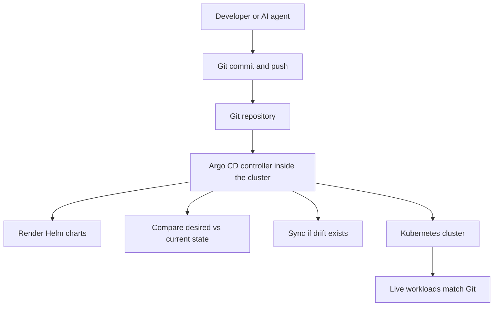
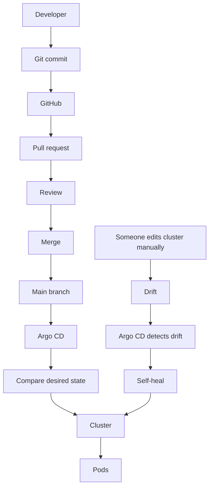

# GitOps at LogiFlow

GitOps is the operating model behind LogiFlow's deployment workflow.
Instead of manually running `helm install` or `kubectl apply`, we declare the desired state in Git and let Argo CD continuously reconcile the cluster back to that state.

## What GitOps Means

GitOps makes Git the single source of truth for infrastructure and application delivery.
An in-cluster controller watches the repository, renders the configured Helm charts, compares desired state with the live cluster, and synchronizes them automatically when they differ.



No manual cluster changes, no hidden state, and no guessing about who changed what.
Everything is versioned, reviewed, and auditable.

## Why LogiFlow Uses GitOps

### 1. Complete audit trail
Every change to every environment is a Git commit. You always know who changed what, when, and why.

### 2. Instant rollback
If a deployment causes a problem, revert the commit and push. Argo CD will resynchronize the cluster to the previous known-good state.

### 3. Pull-based deployments
Argo CD runs inside the cluster and pulls from Git. Developers and CI systems do not need direct production cluster access, which reduces risk.

### 4. Consistency across environments
The app-of-apps pattern keeps each environment aligned. A parent Application watches a dedicated folder of child Application manifests, so dev, staging, and production all follow the same mechanism.

### 5. Safer AI-assisted engineering
AI agents can propose changes through pull requests. CI validates the Helm charts, humans review the PR, and only then does Argo CD deploy the merged change.

### 6. Self-healing
If someone manually edits a live resource with `kubectl edit` or `kubectl scale`, Argo CD detects the drift and restores the Git-defined state.

## Why Developers Should Not Use kubectl in Production

Manual production changes create blind spots and risk:

- No audit trail for who changed what or why.
- Drift between Git and the live cluster.
- Unreviewed changes that bypass CI and peer review.
- Harder rollback when there is no commit history to revert.
- Larger attack surface when more people have direct cluster access.

In a GitOps workflow, developers work through Git, CI, and Argo CD instead of touching the cluster directly.

## GitOps Structure at LogiFlow

The GitOps layout is organized by environment and by child Application manifests:

```text
deployment/gitops/argocd/
├── parent-dev.yaml
├── parent-staging.yaml
├── parent-prod.yaml
├── apps-dev/
│   ├── hello-app.yaml
│   ├── stream-ingestion-app.yaml
│   └── ...
├── apps-staging/
│   ├── hello-app.yaml
│   └── ...
└── apps-prod/
      ├── hello-app.yaml
      └── ...
```

### Parent Applications

Parent Applications tell Argo CD which directory of child Application manifests to watch for a given environment.

### Child Applications

Child Applications define a single service, its Helm chart path, values files, destination namespace, and sync policy.

### Environments

Each environment has its own folder and its own parent Application, which keeps deployments isolated and easy to reason about.

### Adding a new service

To add a service to all environments:

1. Copy the Helm chart from an existing service and adjust the values files.
2. Create child Application manifests in `apps-dev/`, `apps-staging/`, and `apps-prod/`.
3. Commit and push.

## The Mental Model

Think of Argo CD as a Kubernetes controller for your whole application, not just for pods.

- A Deployment controller says: I want 3 pods. If there are only 2, create one more.
- Argo CD says: I want the cluster to match Git. If there is a difference, fix it.

Both are reconciliation loops. Both are declarative. Both run continuously.
The difference is scope: one manages pods, the other manages the application lifecycle.

## Before Argo CD: The Manual World

If you wanted to change the replica count of the `hello` service from 1 to 10, you would typically:

1. Edit `values-dev.yaml` and change `replicaCount: 10`.
2. Run `make dev-up` or `helm upgrade --install hello ...`.
3. Optionally run `helm template` first to inspect the generated YAML.
4. Hope the deployment behaves as expected.

That works, but it does not scale well when many engineers make changes at the same time. It is easy to introduce drift, forget a rollback, or deploy an unreviewed configuration.

## With Argo CD: The Automated World

With GitOps, the same change is simpler:

1. Edit `values-dev.yaml`.
2. Commit and push the change.
3. Argo CD detects the commit, renders the chart, and compares it with the live cluster.
4. If Git says `replicas: 10` and the cluster says `replicas: 1`, Argo CD applies the change.

If the change is invalid, you fix it in Git and push again. If the live cluster drifts, Argo CD reconciles it back.

## How Reconciliation Fixes Drift

Suppose someone runs the following in an emergency:

```bash
kubectl scale deployment hello --replicas=50 -n logiflow
```

The cluster now has 50 replicas, but Git still says 10. With `selfHeal: true`, Argo CD will:

1. Wake up on its reconciliation interval.
2. Compare the desired state from Git with the live cluster.
3. Detect the drift.
4. Reapply the Git state and scale the deployment back to 10 replicas.

The manual change is reverted automatically. Git wins.

## Exact Flow for a Simple Change

Scenario: change the `hello` service message from `Hello from LogiFlow` to `Hello from GitOps`.

1. Edit `deployment/helm/services/hello/values-dev.yaml`.

   ```yaml
   config:
     helloMsg: "Hello from GitOps"
   ```

2. Commit and push:

   ```bash
   git add .
   git commit -m "chore: update hello message for dev"
   git push
   ```

3. Argo CD detects the new commit.
4. The child Application in `apps-dev/` re-renders the Helm chart.
5. Argo CD applies the generated manifests to the `logiflow-dev` namespace.
6. The pod restarts with the new message.

What you did not need to do: run `helm template`, run `helm upgrade`, run `kubectl apply`, port-forward, or manually wait for readiness.

## Why This Is a Major Advantage

| Manual Deployments | GitOps with Argo CD |
| --- | --- |
| You run `helm install` manually | Push to Git and Argo CD deploys automatically |
| You must inspect output before applying | Argo CD renders and diffs before syncing |
| Manual `kubectl edit` can create drift | Argo CD reverts drift automatically |
| Rollback requires finding the right Helm revision | Rollback is a Git revert and push |
| No central audit trail | Every change is a Git commit with author and message |
| CI may need cluster credentials | Only Argo CD needs cluster access |
| Multiple environments mean separate manual steps | One commit updates the correct environment |
| AI agents can make unsafe direct changes | AI agents open PRs and human review gates the merge |

## AI Engineering Connection

GitOps is the safety boundary for AI-assisted infrastructure work.

Without GitOps:

```text
AI -> kubectl apply -> Production
```

With GitOps:

```text
AI Agent -> Generate code -> Open pull request -> CI -> Human review -> Merge -> Argo CD -> Deploy
```

The AI never touches production directly. Git is the control point that keeps automation safe.

## GitOps Flow Diagram

If you want to capture this as a separate visual reference, create `docs/diagrams/gitops-flow.md` with the following story:



## Getting Started

1. Make sure the parent Applications are deployed.
2. Add a child Application manifest for your service in the correct environment folder.
3. Commit and push.
4. Let Argo CD detect and deploy the change.

For local development, continue using `make dev-up`. GitOps is for staging and production, not your local machine.

## Final Takeaway

Argo CD is the deployment controller for the application as a whole. Git is the source of truth, CI validates changes before merge, and Argo CD keeps the live cluster aligned with what is committed.

That gives you a system that is auditable, reversible, self-healing, and safe for both developers and AI agents.