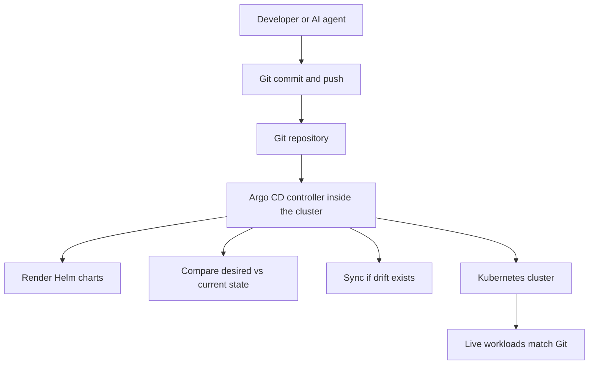
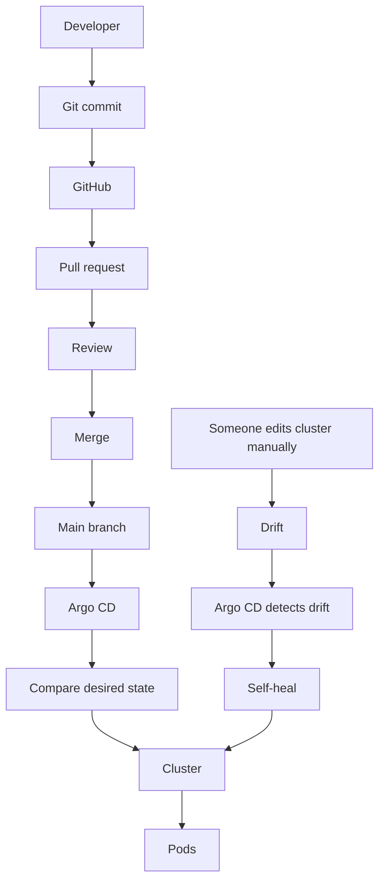
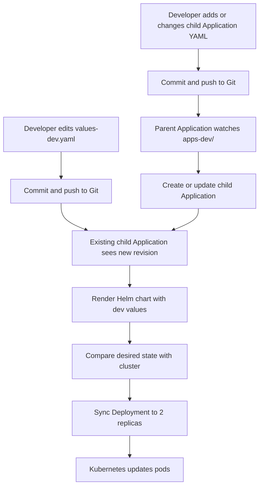

# GitOps at LogiFlow

GitOps is the operating model behind LogiFlow's deployment workflow.
Instead of manually running `helm install` or `kubectl apply`, we declare the desired state in Git and let Argo CD continuously reconcile the cluster back to that state.

## What GitOps Means

GitOps makes Git the single source of truth for infrastructure and application delivery.
An in-cluster controller watches the repository, renders the configured Helm charts, compares desired state with the live cluster, and synchronizes them automatically when they differ.



No manual cluster changes, no hidden state, and no guessing about who changed what.
Everything is versioned, reviewed, and auditable.

## Why LogiFlow Uses GitOps

### 1. Complete audit trail

Every change to every environment is a Git commit. You always know who changed what, when, and why.

### 2. Instant rollback

If a deployment causes a problem, revert the commit and push. Argo CD will resynchronize the cluster to the previous known-good state.

### 3. Pull-based deployments

Argo CD runs inside the cluster and pulls from Git. Developers and CI systems do not need direct production cluster access, which reduces risk.

### 4. Consistency across environments

The app-of-apps pattern keeps each environment aligned. A parent Application watches a dedicated folder of child Application manifests, so dev, staging, and production all follow the same mechanism.

### 5. Safer AI-assisted engineering

AI agents can propose changes through pull requests. CI validates the Helm charts, humans review the PR, and only then does Argo CD deploy the merged change.

### 6. Self-healing

If someone manually edits a live resource with `kubectl edit` or `kubectl scale`, Argo CD detects the drift and restores the Git-defined state.

## Why Developers Should Not Use kubectl in Production

Manual production changes create blind spots and risk:

- No audit trail for who changed what or why.
- Drift between Git and the live cluster.
- Unreviewed changes that bypass CI and peer review.
- Harder rollback when there is no commit history to revert.
- Larger attack surface when more people have direct cluster access.

In a GitOps workflow, developers work through Git, CI, and Argo CD instead of touching the cluster directly.

## GitOps Structure at LogiFlow

The GitOps layout is organized by environment and by child Application manifests:

```text
deployment/gitops/argocd/
├── parent-dev.yaml
├── parent-staging.yaml
├── parent-prod.yaml
├── apps-dev/
│   ├── hello-app.yaml
│   ├── stream-ingestion-app.yaml
│   └── ...
├── apps-staging/
│   ├── hello-app.yaml
│   └── ...
└── apps-prod/
      ├── hello-app.yaml
      └── ...
```

### Parent Applications

Parent Applications tell Argo CD which directory of child Application manifests to watch for a given environment.

### Child Applications

Child Applications define a single service, its Helm chart path, values files, destination namespace, and sync policy.

### Environments

Each environment has its own folder and its own parent Application, which keeps deployments isolated and easy to reason about.

### Adding a new service

To add a service to all environments:

1. Copy the Helm chart from an existing service and adjust the values files.
2. Create child Application manifests in `apps-dev/`, `apps-staging/`, and `apps-prod/`.
3. Commit and push.

## The Mental Model

Think of Argo CD as a Kubernetes controller for your whole application, not just for pods.

- A Deployment controller says: I want 3 pods. If there are only 2, create one more.
- Argo CD says: I want the cluster to match Git. If there is a difference, fix it.

Both are reconciliation loops. Both are declarative. Both run continuously.
The difference is scope: one manages pods, the other manages the application lifecycle.

## Before Argo CD: The Manual World

If you wanted to change the replica count of the `hello` service from 1 to 10, you would typically:

1. Edit `values-dev.yaml` and change `replicaCount: 10`.
2. Run `make dev-up` or `helm upgrade --install hello ...`.
3. Optionally run `helm template` first to inspect the generated YAML.
4. Hope the deployment behaves as expected.

That works, but it does not scale well when many engineers make changes at the same time. It is easy to introduce drift, forget a rollback, or deploy an unreviewed configuration.

## With Argo CD: The Automated World

With GitOps, the same change is simpler:

1. Edit `values-dev.yaml`.
2. Commit and push the change.
3. Argo CD detects the commit, renders the chart, and compares it with the live cluster.
4. If Git says `replicas: 10` and the cluster says `replicas: 1`, Argo CD applies the change.

If the change is invalid, you fix it in Git and push again. If the live cluster drifts, Argo CD reconciles it back.

## How Reconciliation Fixes Drift

Suppose someone runs the following in an emergency:

```bash
kubectl scale deployment hello --replicas=50 -n logiflow
```

The cluster now has 50 replicas, but Git still says 10. With `selfHeal: true`, Argo CD will:

1. Wake up on its reconciliation interval.
2. Compare the desired state from Git with the live cluster.
3. Detect the drift.
4. Reapply the Git state and scale the deployment back to 10 replicas.

The manual change is reverted automatically. Git wins.

## Exact Flow for a Simple Change

Scenario: change the `hello` service message from `Hello from LogiFlow` to `Hello from GitOps`.

1. Edit `deployment/helm/services/hello/values-dev.yaml`.

   ```yaml
   config:
     helloMsg: "Hello from GitOps"
   ```

2. Commit and push:

   ```bash
   git add .
   git commit -m "chore: update hello message for dev"
   git push
   ```

3. Argo CD detects the new commit.
4. The child Application in `apps-dev/` re-renders the Helm chart.
5. Argo CD applies the generated manifests to the `logiflow-dev` namespace.
6. The pod restarts with the new message.

What you did not need to do: run `helm template`, run `helm upgrade`, run `kubectl apply`, port-forward, or manually wait for readiness.

## Why This Is a Major Advantage

| Manual Deployments                                | GitOps with Argo CD                                  |
| ------------------------------------------------- | ---------------------------------------------------- |
| You run `helm install` manually                   | Push to Git and Argo CD deploys automatically        |
| You must inspect output before applying           | Argo CD renders and diffs before syncing             |
| Manual `kubectl edit` can create drift            | Argo CD reverts drift automatically                  |
| Rollback requires finding the right Helm revision | Rollback is a Git revert and push                    |
| No central audit trail                            | Every change is a Git commit with author and message |
| CI may need cluster credentials                   | Only Argo CD needs cluster access                    |
| Multiple environments mean separate manual steps  | One commit updates the correct environment           |
| AI agents can make unsafe direct changes          | AI agents open PRs and human review gates the merge  |

## AI Engineering Connection

GitOps is the safety boundary for AI-assisted infrastructure work.

Without GitOps:

```text
AI -> kubectl apply -> Production
```

With GitOps:

```text
AI Agent -> Generate code -> Open pull request -> CI -> Human review -> Merge -> Argo CD -> Deploy
```

The AI never touches production directly. Git is the control point that keeps automation safe.

## GitOps Flow Diagram

If you want to capture this as a separate visual reference, create `docs/diagrams/gitops-flow.md` with the following story:



## Getting Started

1. Make sure the parent Applications are deployed.
2. Add a child Application manifest for your service in the correct environment folder.
3. Commit and push.
4. Let Argo CD detect and deploy the change.

For local development, continue using `make dev-up`. GitOps is for staging and production, not your local machine.

## The Three Layers of GitOps in LogiFlow

LogiFlow's deployment workflow has three distinct layers. Each layer answers a different question:

| Layer                           | Resource                   | Responsibility                                                                                                 |
| ------------------------------- | -------------------------- | -------------------------------------------------------------------------------------------------------------- |
| 1. What to deploy               | Helm chart and values      | Defines the reusable Kubernetes blueprint and environment-specific configuration.                              |
| 2. Where and how to deploy      | Child Argo CD Application  | Selects the Git path, values files, destination namespace, and sync policy for one service in one environment. |
| 3. How Applications are managed | Parent Argo CD Application | Watches a directory of child Application manifests and keeps those Applications present in the cluster.        |

### Layer 1: Helm chart

`deployment/helm/services/llm-gateway/` is the reusable blueprint for the service. It defines the Deployment, Service, probes, resources, and environment variables through the `logiflow-service` library chart. The environment-specific values are kept in:

- `values-dev.yaml`
- `values-staging.yaml`
- `values-prod.yaml`

The same chart can therefore be rendered differently for dev, staging, and production without copying Kubernetes templates.

### Layer 2: Child Argo CD Application

An Argo CD `Application` is a Kubernetes custom resource that tells Argo CD:

- which Git repository and revision to watch;
- which chart path to render;
- which values files to pass to Helm;
- which cluster and namespace receive the rendered resources; and
- whether to sync automatically, prune removed resources, and self-heal drift.

The llm-gateway child Applications are:

- `apps-dev/llm-gateway-app.yaml`
- `apps-staging/llm-gateway-app.yaml`
- `apps-prod/llm-gateway-app.yaml`

The child Application performs the actual service deployment. Once it exists in the cluster, changes to the chart or its selected values files are handled by that child Application's sync loop.

### Layer 3: Parent Application

A parent Application is also an Argo CD `Application`, but its source is a directory of Kubernetes manifests rather than a Helm chart:

- `parent-dev.yaml` watches `apps-dev/`.
- `parent-staging.yaml` watches `apps-staging/`.
- `parent-prod.yaml` watches `apps-prod/`.

This is the **app-of-apps pattern**. The parent makes sure that every child Application YAML committed to its directory is created or updated in the cluster. The child then deploys the service described by that Application. The parent is the manager of Applications; it does not render the service Helm chart itself.

## Why the Parent Application Is Needed

With 10 services and 3 environments, there may be 30 child Applications. Without a parent, each new child Application would need to be installed manually with `kubectl apply -f`. With the app-of-apps pattern:

1. Install each environment's parent once, usually during Argo CD bootstrap.
2. Add or update a child Application YAML in the appropriate `apps-*` directory.
3. Let the parent create or update that child Application.
4. Let the child render and sync its service chart.

The parent matters when a child Application is added, removed, or changed. It is not involved in ordinary values changes after the child Application already exists.

## How a Change Flows Through GitOps

### Example: scale llm-gateway from 1 to 2 replicas in dev

1. Edit `deployment/helm/services/llm-gateway/values-dev.yaml`:

   ```yaml
   replicaCount: 2
   ```

2. Commit and push the values change:

   ```bash
   git add deployment/helm/services/llm-gateway/values-dev.yaml
   git commit -m "chore: scale llm-gateway to 2 replicas in dev"
   git push
   ```

3. The existing `llm-gateway` child Application detects the new Git revision through its normal reconciliation or a repository webhook.
4. The child renders `deployment/helm/services/llm-gateway/` with its configured dev values file.
5. Argo CD compares the rendered Deployment, sees `replicas: 2` instead of `1`, and syncs the difference.
6. Kubernetes updates the Deployment and replaces or adds pods as needed.

The parent does not participate in this values-only change because `apps-dev/` did not change. The parent is involved when a new service is introduced or the child Application manifest itself changes, such as changing its destination namespace.



## Complete GitOps Workflow

### Initial setup

Argo CD must be installed in the target cluster first. Then bootstrap the parent Applications once:

```bash
kubectl apply -f deployment/gitops/argocd/parent-dev.yaml
kubectl apply -f deployment/gitops/argocd/parent-staging.yaml
kubectl apply -f deployment/gitops/argocd/parent-prod.yaml
```

Each parent syncs its environment folder and creates the child Applications found there. In a managed setup, these parent resources may instead be installed by an Argo CD bootstrap process.

### Adding a service

1. Create the service Helm chart and its environment values files.
2. Add one child Application manifest to each required `apps-*` directory.
3. Set the chart path, values files, destination namespace, and sync policy in each child Application.
4. Commit and push the chart, values, and child Application manifests.
5. The parent discovers each new child Application, and each child deploys its environment.

### Changing values after setup

Edit the relevant values file, commit, and push. The existing child Application handles the render, diff, and sync. You do not need to reinstall the parent or run `helm upgrade` against a shared cluster.

### Production secrets

Do not commit `values-prod-secrets.yaml` or API keys to Git. The production child Application currently references that file in addition to the shared and production values files. Before production sync, provide the secret values through an approved secret-management mechanism, such as sealed secrets, an external secrets operator, or a CI/CD substitution step. Argo CD cannot render a values file that is intentionally absent from the repository unless that mechanism makes it available to the renderer.

## Local Development and Simulation

Local development is intentionally different from shared-environment GitOps. From the llm-gateway chart directory, use Helm directly:

```bash
cd deployment/helm/services/llm-gateway
helm upgrade --install llm-gateway . \
  -f values-dev.yaml \
  --namespace logiflow
```

The repository's `make dev-up` command also uses direct local deployment automation. This is appropriate for fast iteration on a personal Kind cluster; it is not the shared-cluster GitOps workflow.

When Argo CD is not installed in Kind, simulate the child sync from the repository root:

```bash
helm template llm-gateway deployment/helm/services/llm-gateway \
  -f deployment/helm/services/llm-gateway/values-dev.yaml \
  --namespace logiflow-dev \
  | kubectl apply -f -
```

To simulate a drift correction, change the live replica count and apply the desired output again:

```bash
kubectl scale deployment llm-gateway --replicas=5 -n logiflow-dev

helm template llm-gateway deployment/helm/services/llm-gateway \
  -f deployment/helm/services/llm-gateway/values-dev.yaml \
  --namespace logiflow-dev \
  | kubectl apply -f -
```

The second command restores the replica count declared by Git. This approximates the render-and-apply portion of a child Application, but it does not provide Argo CD's continuous reconciliation, history, or self-healing controller.

## Final Takeaway

Git is the source of truth. The parent Application manages the set of child Applications, and each child Application renders and deploys one service to one environment using the reusable Helm chart. Values changes flow through the existing child; new services and Application changes flow through the parent first.
