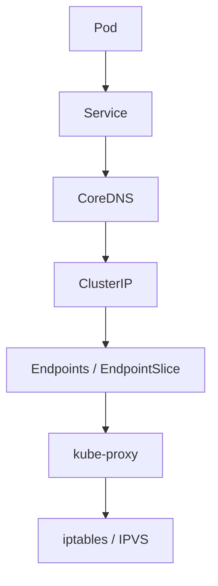
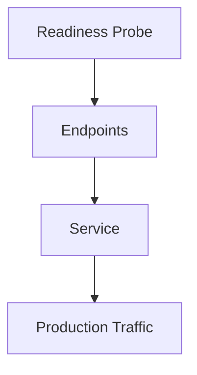
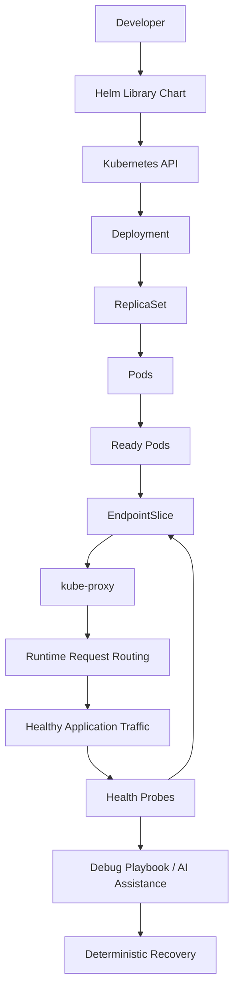

# ADR-010: Runtime Service Discovery and Operational Diagnostics Strategy

**Date:** 2026-07-26  
**Status:** Accepted  
**Author:** Aunmoy Dey Tanmoy  
**Decision Owner:** Aunmoy Dey Tanmoy  
**Project:** LogiFlow

## Context

LogiFlow needs runtime networking and diagnostics that are native to Kubernetes, easy to operate, and predictable enough to support both human operators and future AI-assisted operations.

The platform should avoid introducing extra service-discovery infrastructure, should route traffic only to healthy workloads, and should define a deterministic debugging workflow that engineers can follow under pressure.

## Decision

### 1. Use Kubernetes-native service discovery

Service-to-service communication uses Kubernetes Service discovery only.



No Consul.
No custom registry.
No Redis-backed service map.

### 2. Route traffic only to Ready Pods

Only Ready Pods receive production traffic.



If readiness fails, the Pod is removed from the Service endpoints and traffic stops automatically.

### 3. Standardize operational diagnostics

Debugging must follow a deterministic Kubernetes-first workflow:

```text
describe -> events -> logs -> endpoints -> service -> root cause
```

This is not a suggestion. It is an operational contract.

### 4. Make the platform AI-operable, not AI-autonomous

AI agents must not directly delete or repair resources in production.
They must follow the same deterministic workflow as human operators:

```text
alert -> inspect -> diagnose -> recommend -> human approval -> repair
```

This creates the foundation for future AgentOps without weakening operational safety.

## Operational Model

The runtime flow is intentionally simple:



This diagram connects the deployment model, health model, traffic routing, and diagnostic workflow into one control loop.

## Consequences

### Positive

- Native Kubernetes networking with no extra control plane.
- Standard traffic routing behavior that every Kubernetes engineer understands.
- Zero additional service-discovery infrastructure to maintain.
- A deterministic debugging workflow that reduces guesswork.
- AI-ready operations with a human approval boundary.
- Predictable incident response and easier onboarding.
- Less tribal knowledge because the workflow is explicit.

### Negative

- Runtime networking is tied to Kubernetes primitives.
- Engineers must understand readiness versus liveness.
- Diagnostics assume familiarity with Kubernetes tooling.
- External traffic still requires Ingress or a similar edge mechanism.

## Operational Contract

When a service is unhealthy, the platform should not route traffic to it.
When a resource is drifting from the desired state, the platform should surface the drift through the standard debug flow.
When AI is involved, it should recommend and assist, not execute unsupervised repairs.

## References

- Related runbook: [docs/runbooks/debug-playbook.md](../runbooks/debug-playbook.md)
- Platform networking context: [ADR-002: Service Networking](002-service-networking.md)
