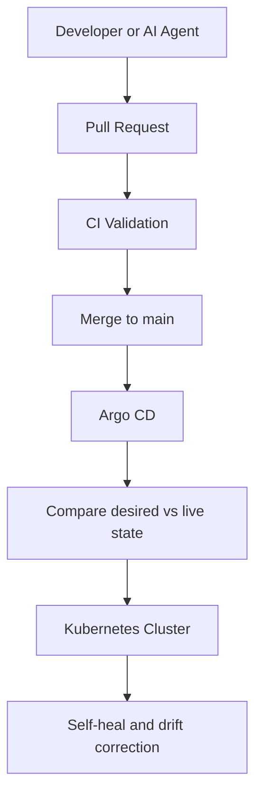

# ADR-011: GitOps Deployment Strategy with Argo CD

**Date:** 2026-07-28  
**Status:** Accepted  
**Author:** Aunmoy Dey Tanmoy  
**Decision Owner:** Aunmoy Dey Tanmoy  
**Project:** LogiFlow  
**Related:** ADR-005 (Platform Standardization), ADR-007 (Contracts and Versioning)

## Context

LogiFlow is growing toward 15+ microservices, each deployed across development, staging, and production.
The current imperative model relies on local `make dev-up` workflows for development and manual `helm upgrade --install` steps for shared environments.

That approach introduces drift, weak auditability, manual toil, inconsistent environments, and unnecessary production access.
As the platform becomes AI-native, deployment must be deterministic, auditable, and safe for both humans and AI agents.

## Problem

How should LogiFlow manage applications across multiple environments so the live cluster always matches the intended state in version control, without requiring direct human access to production clusters?

## Decision

LogiFlow adopts a GitOps deployment strategy with Argo CD as the reconciliation engine.

### 1. Git is the single source of truth

The desired state of every application in every environment is declared in Git, not in a terminal, pipeline script, or live cluster.

### 2. Argo CD reconciles the cluster

Argo CD continuously watches Git, renders the desired manifests, compares them to the live cluster, and synchronizes drift when automated sync is enabled.

### 3. App of apps organizes environments

Each environment has a parent Application that watches a dedicated directory of child Application manifests.
This keeps dev, staging, and production isolated while using the same deployment pattern.

```text
deployment/gitops/argocd/
├── parent-dev.yaml        # watches apps-dev/
├── parent-staging.yaml    # watches apps-staging/
├── parent-prod.yaml       # watches apps-prod/
├── apps-dev/
│   ├── hello-app.yaml
│   ├── stream-ingestion-app.yaml
│   └── ...
├── apps-staging/
│   └── ...
└── apps-prod/
	└── ...
```

Each child Application defines:

- The Git repository and Helm chart path.
- The environment-specific values file.
- The target cluster and namespace.
- The sync policy, including automated sync, prune, and self-heal.

### 4. Automated sync, prune, and self-heal are mandatory

- `automated` means Git changes apply without manual intervention.
- `prune: true` means resources removed from Git are deleted from the cluster.
- `selfHeal: true` means manual production edits are reverted back to Git-defined state.

### 5. CI validates, Argo CD deploys

CI pipelines lint and render charts with `helm template`, but they do not deploy to clusters.
Deployment is the responsibility of Argo CD inside the cluster.

### 6. Local development stays imperative

`make dev-up` and `helm upgrade --install` remain the right tools for local iteration.
GitOps governs shared environments, not a developer’s laptop.

## Rationale

This model gives LogiFlow a deployment system that is:

- Auditable, because every change is a Git commit.
- Reversible, because rollback is a Git revert.
- Safe, because developers and CI do not need production cluster credentials.
- Consistent, because all environments use the same control pattern.
- AI-ready, because AI agents can propose changes without being given direct cluster authority.



## Consequences

### Positive

- Every deployment is traceable to a Git commit.
- `git revert` becomes the rollback mechanism.
- Production drift is corrected automatically.
- Git and cluster state stay aligned across environments.
- The attack surface is reduced because production credentials stay with Argo CD.
- AI agents can contribute safely through pull requests.
- Adding a new service becomes a repeatable Git operation.

### Risks

- Argo CD becomes critical platform infrastructure.
- The initial bootstrap requires discipline and one-time setup effort.
- Secrets cannot live plainly in Git and require a secret-management strategy.
- The team must learn GitOps concepts and Argo CD operational behavior.

## Alternatives Considered

| Alternative | Why Rejected |
| --- | --- |
| Push-based CI/CD with `helm upgrade` | Requires direct cluster access and creates a deployment bottleneck. |
| Manual `helm install` / `kubectl apply` | No audit trail, high drift risk, and poor scalability. |
| Using only `make dev-up` for all environments | Not suitable for shared or production environments. |
| Kustomize with a push model | Still lacks continuous reconciliation and has similar access risks. |
| FluxCD | Valid alternative, but Argo CD provides the application-centric model and UI preferred for this platform. |

## AI Platform Alignment

LogiFlow is designed as an AI-native internal developer platform.
In that model:

- AI agents generate scaffolds, values, and infrastructure changes.
- Git is the safety boundary.
- CI validates the change.
- Humans review and merge.
- Argo CD deploys automatically.

This preserves control while still allowing automation to move quickly.

## Implementation Status

- [x] Parent Applications for `logiflow-dev`, `logiflow-staging`, and `logiflow-prod` defined.
- [x] Child Application manifests for `hello` and `stream-ingestion` created in the environment directories.
- [x] GitOps flow validated conceptually using `helm template | kubectl apply`.
- [ ] Argo CD controller installed on the target cluster(s).
- [ ] Parent Applications bootstrapped in the cluster.
- [ ] External secrets management integrated for production secrets.

## References

- GitOps configuration: [deployment/gitops/argocd/](../../deployment/gitops/argocd/)
- GitOps README: [deployment/gitops/argocd/README.md](../../deployment/gitops/argocd/README.md)
- Helm library chart: [deployment/helm/library/logiflow-service/](../../deployment/helm/library/logiflow-service/)
- ADR-005: Platform Standardization with Helm Library Charts
- ADR-007: Platform Contracts and Versioning