# LLM Gateway Low-Level Design

## 1. Purpose And Status

This document translates the LLM Gateway HLD into an implementation-level design. It defines package responsibilities, interfaces, object relationships, concurrency rules, failure handling, data contracts, security boundaries, and testable behavior.

The design is intentionally explicit about implementation status. The repository currently contains the deploy-first HTTP process and DDD folder skeleton. The provider, gRPC, Redis, Kafka, validation, resilience, and telemetry components described below are the target implementation contract, not claims that those components already exist.

The service solves one problem: provide a safe and stable internal boundary for controlled AI execution. Internal callers should not know vendor request formats, provider error codes, retry mechanics, tenant budget storage, or model-output validation details.

## 2. Goals And Non-Goals

### Goals

- Expose one provider-neutral completion contract to trusted internal callers.
- Preserve tenant isolation across authorization, cache, budgets, events, and telemetry.
- Reject untrusted or semantically invalid model output before automation sees it.
- Bound provider latency, retries, concurrency, response size, and spending.
- Route around operational provider failures without retrying semantic failures.
- Keep the gateway application instances stateless and independently scalable.
- Emit durable usage events without putting PostgreSQL on the completion hot path.
- Make every policy independently unit-testable through narrow interfaces.

### Non-Goals

- The gateway does not own shipment persistence or ingestion.
- It does not decide logistics policy such as whether a shipment is late.
- It does not expose provider API keys to callers.
- It does not silently repair, clamp, or invent model output.
- It does not use Kafka as a request-reply transport for synchronous completions.
- It does not write high-frequency telemetry directly to the business ledger.

## 3. System Context

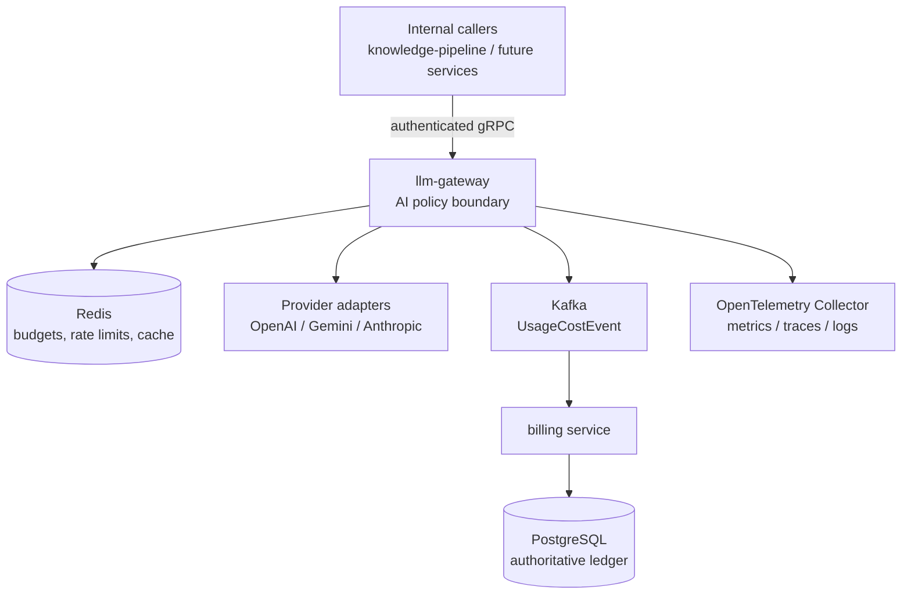

The gateway is an Anti-Corruption Layer. It translates between the internal LogiFlow completion model and incompatible external provider models. This protects the domain from vendor SDKs and prevents provider behavior from leaking into upstream services.

## 4. Package And Component Layout

```text
cmd/llm-gateway/main.go                 Composition root; wiring only
services/llm-gateway/
  domain/
	model.go                             Entities and value objects
	errors.go                            Typed domain failures
	policy.go                            Pure business invariants
	events.go                            Domain and usage event types
  application/
	commands.go                          Completion command DTOs
	queries.go                           Read/query DTOs
	ports.go                             Dependency inversion interfaces
	service.go                           Use-case orchestration
	service_test.go                      Application behavior tests
  interfaces/
	grpc/handler.go                      Synchronous completion adapter
	http/handler.go                      Health and operational HTTP adapter
	kafka/handler.go                     Event adapter when required
	mcp/handler.go                       Optional tool adapter
	temporal/handler.go                  Optional workflow adapter
  infrastructure/
	provider/                             External provider adapters
	redis/                                Budget, rate-limit, cache adapters
	kafka/                                Usage event publisher
	postgres/                             Non-hot-path persistence adapters
	keycloak/                             Service identity adapter
```

The dependency direction is inward:

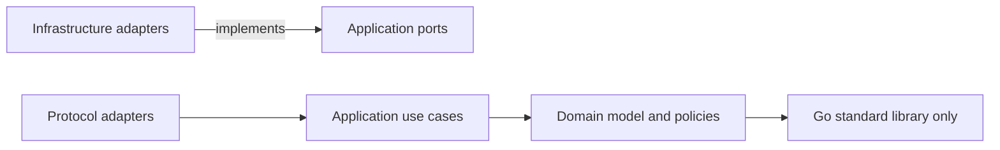

Domain code must not import infrastructure or transport packages. Application code depends on interfaces, never concrete Redis clients, Kafka producers, or provider SDKs.

## 5. Core Domain Model

The gateway's bounded context is **Controlled, Safe, and Cost-Capped AI Execution**.

### 5.1 Request

```go
type CompletionRequest struct {
	RequestID      string
	TenantID       string
	EvidenceID     string
	ShipmentID     string
	PromptVersion  string
	Policy         ModelPolicy
	Input          string
	MaxTokens      int
	TraceContext   TraceContext
}
```

Required invariants:

- `TenantID`, `RequestID`, and `Input` are present and bounded in size.
- The request is authorized for the tenant and caller identity.
- `MaxTokens` is within a configured upper bound.
- `PromptVersion` is explicit for reproducibility and cache identity.

### 5.2 Trusted Completion Result

```go
type CompletionResult struct {
	ShipmentID          string
	Risk                RiskLevel
	Confidence          float64
	Reasons             []string
	Provider            string
	Model               string
	PromptVersion       string
	PromptTokens        int
	CompletionTokens    int
	EstimatedCostCents  int64
	ProviderLatencyMS   int64
	ValidationLatencyMS int64
	TraceID             string
}
```

Only a result that passes syntax, schema, and domain validation may be constructed as a `CompletionResult`.

### 5.3 Domain Invariants

The target risk contract requires `shipment_id`, `risk`, `confidence`, and `reasons`.

- `confidence` must satisfy $0.0 \leq \mathrm{confidence} \leq 1.0$.
- `risk` must be one of the supported values.
- A `high_risk` result must contain at least one meaningful reason.
- `reasons` must have bounded count and length.
- `shipment_id` must not be empty when risk is tied to a shipment.

Invalid values are rejected. A confidence of `1.7` is not clamped to `1.0`, and an empty reason list is not filled with a fabricated value.

## 6. Object-Oriented Design In Go

Go uses composition and interfaces rather than inheritance-heavy class hierarchies. The design uses objects as small structs with explicit responsibilities and interfaces as behavioral contracts.

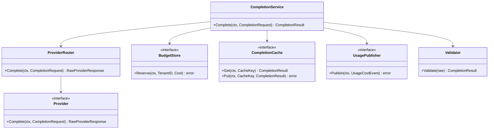

### SOLID Principles

**Single Responsibility:** `Validator` validates, `ProviderRouter` chooses providers, `BudgetStore` manages budget state, and `UsagePublisher` publishes events. None of these objects owns the whole workflow.

**Open/Closed:** Adding an Anthropic adapter should add a new `Provider` implementation and configuration entry without changing the domain or completion use case.

**Liskov Substitution:** Every provider adapter must honor the same context, response, size, timeout, and error-normalization contract. A fake provider must be safely substitutable in tests.

**Interface Segregation:** The application depends on small ports such as `Provider`, `BudgetStore`, `CompletionCache`, and `UsagePublisher`, rather than one large infrastructure interface.

**Dependency Inversion:** The use case depends on abstractions. Concrete HTTP clients, Redis clients, Kafka clients, and SDKs are injected at the composition root.

## 7. Application Ports

The following interfaces are the stable seams between policy and infrastructure:

```go
type Provider interface {
	Complete(ctx context.Context, request domain.CompletionRequest) (RawProviderResponse, error)
}

type BudgetStore interface {
	Reserve(ctx context.Context, tenantID string, estimate CostEstimate) error
	Reconcile(ctx context.Context, tenantID string, actual Usage) error
}

type CompletionCache interface {
	Get(ctx context.Context, key CacheKey) (domain.CompletionResult, bool, error)
	Put(ctx context.Context, key CacheKey, result domain.CompletionResult, ttl time.Duration) error
}

type UsagePublisher interface {
	Publish(ctx context.Context, event domain.UsageCostEvent) error
}

type Authorizer interface {
	Authorize(ctx context.Context, tenantID string, caller CallerIdentity) error
}

type Clock interface {
	Now() time.Time
}
```

These ports make failure behavior and concurrency testable without running external systems.

## 8. Completion Orchestration

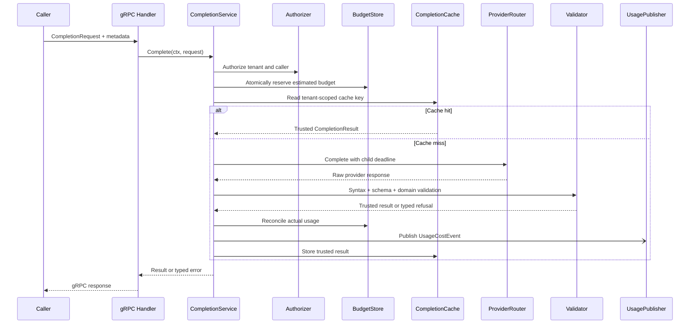

The usage event is asynchronous from the caller's perspective, but publication must have a defined durability policy. If the event cannot be accepted by the configured durable publisher, the service must not claim billing was recorded; the implementation should either use an outbox or return an explicit operational error according to the selected consistency policy.

## 9. Provider Adapter Design Patterns

### Adapter Pattern

Each provider adapter translates the internal `CompletionRequest` into a vendor request and maps the vendor response into `RawProviderResponse`. The application never sees OpenAI, Gemini, or Anthropic SDK types.

### Strategy Pattern

`ProviderRouter` selects a provider based on model policy, tenant policy, availability, cost, and circuit state. Selection is data-driven and does not require callers to know vendor APIs.

### Factory Pattern

The composition root uses a provider factory to build adapters from configuration. It validates credentials and endpoints at startup while keeping construction out of the use case.

### Decorator Pattern

Provider calls can be wrapped with deadline enforcement, metrics, tracing, retry policy, and circuit breaking. Each decorator has one concern and can be composed in a deliberate order.

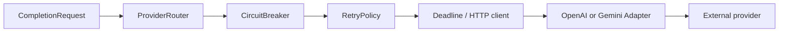

Recommended order: authorization and budget before provider selection; circuit state before network calls; timeout around every outbound call; validation after a response; usage accounting only after a trusted result.

## 10. Timeout, Retry, And Circuit-Breaker Rules

### Context Cancellation

Every external request receives a child context with a strict deadline, generally two to five seconds. Go goroutines cannot be killed externally; cancellation is cooperative. `http.NewRequestWithContext` causes the HTTP client to stop waiting and the goroutine exits naturally.

### Retry Policy

Retry only operational failures such as network errors, timeouts, HTTP 429, and selected HTTP 5xx responses. Use bounded exponential backoff with jitter. A retry consumes an attempt and must not bypass tenant or provider budgets.

Never retry a domain-invariant failure. Retrying an answer with confidence `1.7` wastes tokens and can hide a model or prompt defect.

### Circuit State

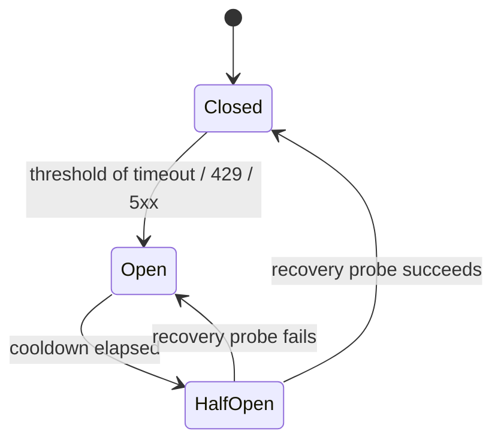

Circuit state is independent per provider. An OpenAI outage must not remove Gemini capacity. An open circuit fails fast into the fallback router; it does not wait for the provider timeout.

## 11. Concurrency Model

The gateway uses concurrency deliberately rather than treating unlimited goroutines as capacity.

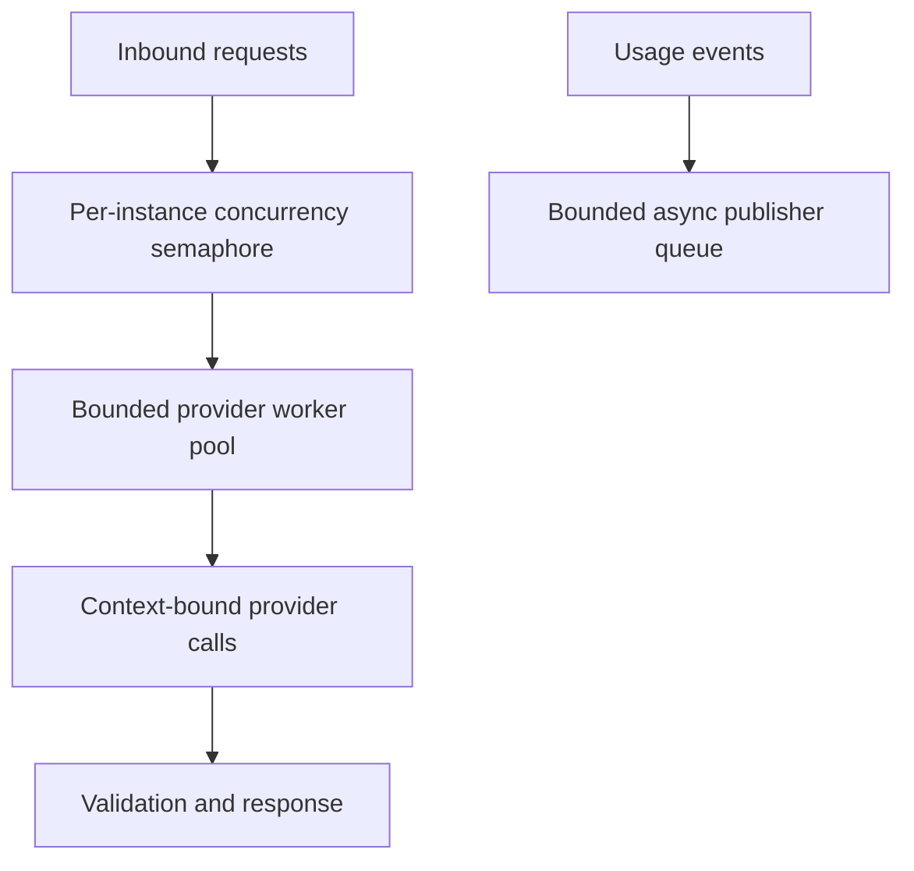

Rules:

- HTTP and gRPC handlers remain non-blocking except for their bounded request work.
- A semaphore limits simultaneous provider calls per instance.
- Worker pools are bounded by memory, provider quotas, and downstream capacity.
- Every goroutine has an owner, a cancellation path, and a termination condition.
- Channels are for coordination and backpressure, not a replacement for network requests.
- Shutdown closes intake, cancels outstanding work, drains safe event buffers, and waits with a deadline.
- Shared mutable counters require atomic operations or a mutex; cross-replica state belongs in Redis.

### Redis Token Bucket

For tenant rate limiting, Redis executes refill and consume as one Lua script. With capacity $C$, refill rate $R$, current time $t$, and previous time $t_0$:

$$\mathrm{tokens}_{new} = \min(C, \mathrm{tokens}_{old} + (t - t_0)R)$$

If at least one token exists, the script decrements and accepts the request. Otherwise it returns a rate-limit decision. A read-then-write sequence is not acceptable because concurrent replicas could oversubscribe the tenant.

## 12. Redis State And Consistency

Suggested key namespaces:

```text
tenant:{tenant_id}:budget
tenant:{tenant_id}:rate:{operation}
llm:cache:{tenant_id}:{prompt_version}:{request_hash}
llm:circuit:{provider}
```

Tenant ID and prompt version are mandatory cache dimensions. Cache values must be trusted `CompletionResult` objects, not unvalidated raw provider text.

Budget enforcement is a financial and abuse-prevention invariant. The default policy is fail closed when the authoritative Redis write path is unavailable:

- `codes.ResourceExhausted`: budget is known to be exhausted.
- `codes.Unavailable`: budget authority or required state infrastructure cannot be reached.

Redis replicas are read-only under standard replication. The gateway must never issue budget decrements or rate-limit writes to a replica. AP or fail-open behavior may be considered for non-critical cache reads only, with its stale-data and overspend risks documented.

## 13. Kafka Usage Events And Billing

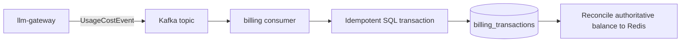

Target event fields:

```go
type UsageCostEvent struct {
	EventID            string
	RequestID          string
	TenantID           string
	TraceID            string
	Provider           string
	Model              string
	PromptVersion      string
	PromptTokens       int
	CompletionTokens   int
	EstimatedCostCents int64
	OccurredAt         time.Time
}
```

`EventID` is the idempotency key. Billing must tolerate redelivery and commit a single ledger entry for a single usage event. Kafka is selected for replay, buffering, and independent consumer scaling. PostgreSQL remains the durable financial source of truth, but it is removed from the synchronous completion path to avoid lock and connection-pool contention.

## 14. Structured Validation Pipeline

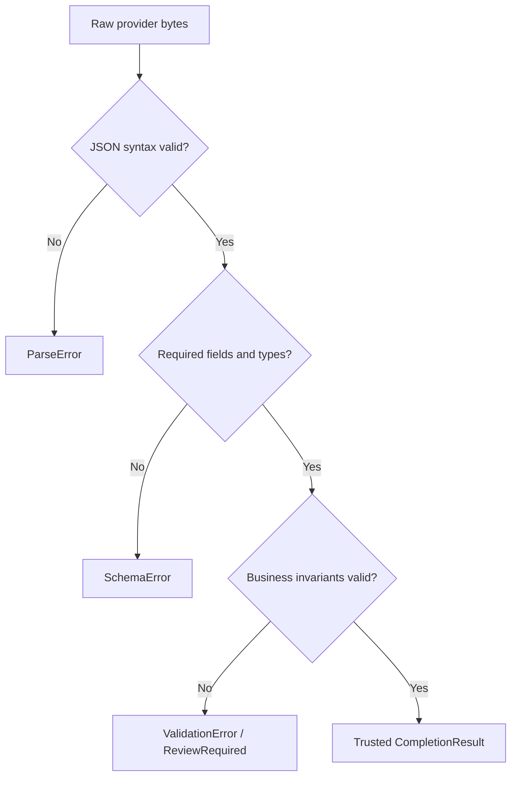

The stages are intentionally separate:

1. Syntax asks whether bytes can be parsed.
2. Schema asks whether required fields and types exist.
3. Domain validation asks whether the result makes business sense.

For a semantic failure, return a refusal and route the work to human review or a workflow engine. Do not automatically retry or fall back merely because the output is logically invalid.

## 15. gRPC Interface Contract

The planned gRPC adapter should expose a versioned protobuf contract similar to:

```protobuf
service LLMGateway {
  rpc Complete(CompletionRequest) returns (CompletionResponse);
}

message CompletionRequest {
  string request_id = 1;
  string tenant_id = 2;
  string evidence_id = 3;
  string shipment_id = 4;
  string prompt_version = 5;
  string input = 6;
  int32 max_tokens = 7;
}
```

The handler maps protobuf DTOs to domain types and maps typed domain errors to standard status codes. It should extract `traceparent` and authorized tenant context from metadata, enforce message-size limits, and never pass generated protobuf types into domain code.

## 16. Observability And Trace Propagation

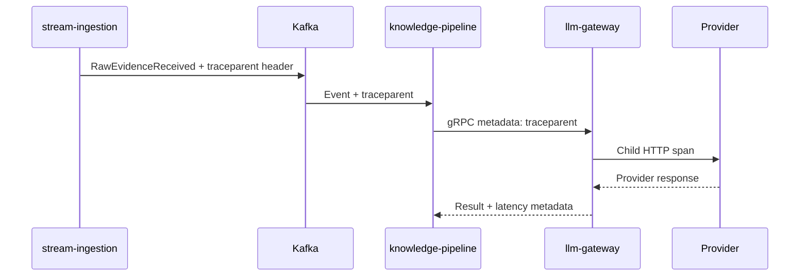

Required diagnostic fields:

- `trace_id` and request ID.
- Tenant-safe correlation identifier.
- `model_provider`, model, and `prompt_version`.
- `provider_latency_ms`.
- `validation_latency_ms`.
- `total_gateway_latency_ms`.
- Token counts, estimated cost, cache outcome, retry count, breaker state, and final status.

Do not log provider credentials, raw prompts, or sensitive completions by default. Export telemetry asynchronously through OpenTelemetry Collector to systems suited to traces, metrics, and logs rather than the primary PostgreSQL ledger.

## 17. Security Design

- Authenticate the calling service and authorize its tenant scope.
- Validate tenant identity before cache, budget, provider, or event operations.
- Store provider credentials in Kubernetes Secrets or an external secret manager.
- Use TLS and authenticated service identity for production gRPC.
- Apply least privilege to Redis, Kafka, provider, and secret-manager clients.
- Enforce request and response size limits.
- Redact prompts, completions, tokens, and credentials from logs.
- Use tenant-scoped cache keys and never reuse a result across tenants.
- Preserve refusal events for audit without exposing sensitive model content.

## 18. Deployment And Runtime Contract

The current runtime is packaged by `build/Dockerfile.llm-gateway` and deployed by `deployment/helm/services/llm-gateway/`.

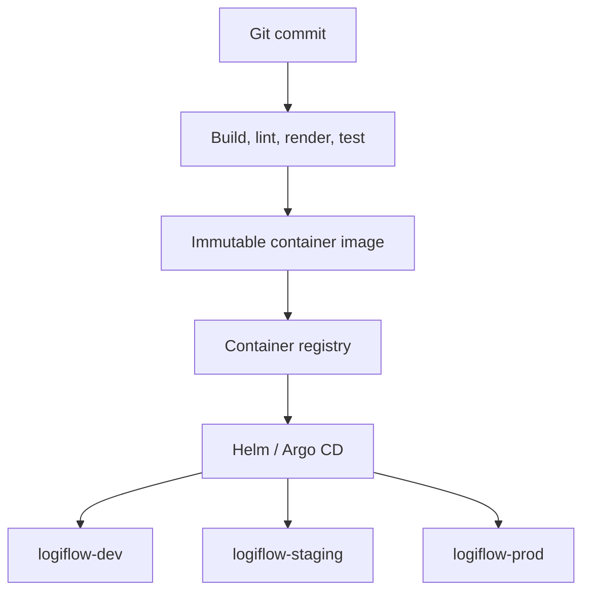

Runtime requirements:

- Listen on `PORT`, default `8080`.
- Serve `GET /healthz`, `GET /startupz`, and `GET /live`.
- Start accepting traffic only after required dependencies are ready, when dependency checks are implemented.
- Stop accepting new work before graceful shutdown.
- Run non-root with read-only filesystem and dropped capabilities through the library chart.
- Use explicit resource requests and limits.
- Use immutable image tags outside local Kind development.

## 19. Testing Plan

### Unit Tests

- Domain confidence and risk/reasons invariants.
- Cache-key tenant isolation.
- Error classification and gRPC status mapping.
- Retry eligibility and exponential backoff bounds.
- Circuit transitions and half-open probing.

### Contract And Integration Tests

- Provider adapters normalize success, timeout, 429, 5xx, malformed, and oversized responses.
- Redis Lua scripts are atomic under concurrent callers.
- Kafka events contain required fields and are idempotent by `EventID`.
- gRPC metadata propagates trace and tenant context.
- Helm renders each environment overlay with valid probes and security settings.

### Concurrency And Failure Tests

- Context cancellation terminates provider calls.
- Bounded semaphores prevent unbounded in-flight work.
- Shutdown drains or explicitly rejects queued work.
- Provider outage opens only the failing provider circuit.
- Fallback output passes the same validation as primary output.
- Redis unavailability fails closed for budget enforcement.

### End-To-End Tests

- Build the image, load it into Kind, deploy the chart, wait for readiness, and call all health endpoints.
- Exercise a happy path, operational fallback, semantic refusal, budget exhaustion, and duplicate usage event.
- Run load tests with realistic provider latency and tenant distribution.

## 20. Decision And Trade-Off Matrix

| Concern              | Decision                                  | Why chosen                                                 | Trade-off                                           |
| -------------------- | ----------------------------------------- | ---------------------------------------------------------- | --------------------------------------------------- |
| Service boundary     | Dedicated gateway                         | Independent scaling, governance, and runtime isolation     | Internal network hop and another service to operate |
| Domain structure     | DDD plus ports and adapters               | Keeps business rules independent of vendors and frameworks | More interfaces and wiring than a direct SDK call   |
| Completion transport | gRPC                                      | Typed, deadline-aware request-response contract            | Requires protobuf versioning and service discovery  |
| Usage transport      | Kafka event                               | Replayable, durable, independently scalable accounting     | Eventual consistency and consumer operations        |
| Financial ledger     | PostgreSQL in billing                     | ACID, auditable source of truth                            | Not suitable for every hot-path completion write    |
| Hot-path state       | Redis                                     | Shared, low-latency atomic counters                        | External dependency and failure policy complexity   |
| Provider abstraction | Adapter plus Strategy                     | Vendor replacement without upstream changes                | Requires normalized error and capability contracts  |
| Resilience           | Timeout, bounded retry, breaker, fallback | Contains provider outages and resource exhaustion          | Extra latency, cost, and model-quality variation    |
| Output handling      | Refuse invalid semantics                  | Prevents unsafe automation and silent corruption           | Some work requires human review                     |
| Cache                | Tenant-scoped semantic cache              | Lower cost and latency                                     | Staleness, invalidation, and privacy concerns       |
| Concurrency          | Bounded workers and contexts              | Predictable memory and provider pressure                   | Requests may be rejected or queued under overload   |
| Telemetry            | W3C tracing and async export              | Cross-service diagnosis without ledger contention          | Instrumentation and storage cost                    |

## 21. Implementation Sequence

1. Define protobuf and domain contracts.
2. Implement domain entities, typed errors, and invariant tests.
3. Implement application ports and completion orchestration with fakes.
4. Implement gRPC handler and status mapping.
5. Implement provider adapters, factory, strategy router, and normalization.
6. Add context deadlines, bounded retries, circuit breakers, and fallback.
7. Add Redis atomic budget, rate limiting, and tenant-scoped caching.
8. Add Kafka usage events, idempotency, and billing reconciliation contract.
9. Add W3C tracing, metrics, structured logs, and latency fields.
10. Add integration, failure-injection, load, and Kind smoke tests.
11. Promote immutable images through GitOps environments.

## 22. References

- [LLM Gateway HLD](System_Design.md)
- [Root platform README](../../README.md)
- [LLM Gateway service README](README.md)
- [Service generation runbook](../../docs/runbooks/generate-service.md)
- [Platform engineer runbook](../../docs/runbooks/runbook-platform-engineer.md)
- [LLM Gateway HLD source PDF](LogiFlow_%20LLM_GATEWAY_HLD.pdf)
