# LogiFlow LLM Gateway — System Design

## 1. Purpose

The `llm-gateway` is the controlled AI execution boundary of LogiFlow.

It isolates internal services from external model providers and provides one governed application contract for AI execution, provider reliability, output trust promotion, usage metadata, and operational diagnosis.

The gateway's bounded context is:

> **Controlled, Safe, and Cost-Aware AI Execution**

The gateway is intentionally not the logistics system of record, the evidence store, the retrieval engine, the billing ledger, or the workflow engine.

---

# 2. Business Context

LogiFlow operates on logistics evidence such as shipment events, delay notices, carrier communication, invoices, customs documents, reports, notes, and customer messages.

The business wants AI-assisted operational decisions, but direct provider calls from every service create several risks:

- vendor-specific SDKs spread across the codebase;
- different services enforce different prompt and validation rules;
- provider outages leak into business workflows;
- tenant cost becomes difficult to attribute;
- invalid model output can reach automation;
- observability is fragmented;
- credential handling expands across services.

The gateway centralizes the AI execution boundary while keeping business memory and business ownership outside it.

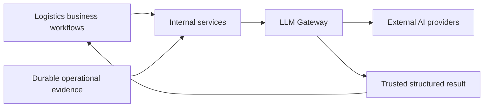

---

# 3. Architectural Goals

The design optimizes for:

1. **A stable application boundary** for multiple AI capabilities.
2. **Tenant-safe execution** with explicit ownership identity.
3. **Strict trust promotion** from untrusted model output to trusted domain result.
4. **Provider isolation** through application-owned ports and adapters.
5. **Bounded resilience** for transient provider failures.
6. **Deterministic testing** without external provider credentials.
7. **Privacy-safe usage/audit metadata**.
8. **Operational diagnosis** using logs, metrics, traces, and execution metadata.
9. **Stateless application instances**.
10. **Repeatable Kubernetes delivery** using Helm and GitOps.

---

# 4. Architectural Non-Goals

The gateway does not become the owner of:

- raw evidence persistence;
- document ingestion;
- chunking and embedding;
- vector retrieval;
- shipment storage;
- billing ledger state;
- workflow orchestration state;
- model training;
- GPU scheduling;
- arbitrary prompt routing based on free-form user text.

These are separate responsibilities with independent ownership boundaries.

---

### Why This Is a Dedicated Service

A shared Go client library can standardize request structures, but it cannot provide the same runtime isolation as a separate gateway. A dedicated service allows provider policy, budgets, retry/circuit state, telemetry, and model-provider changes to evolve without requiring every caller to redeploy at the same time.

The trade-off is an internal network hop and another deployable. The design accepts that cost because the gateway is an explicit **policy, trust, and external-dependency boundary** rather than a thin SDK wrapper.

| Concern              | Dedicated gateway               | Shared client library          |
| -------------------- | ------------------------------- | ------------------------------ |
| Provider migration   | One adapter/policy boundary     | Coordinate every consumer      |
| AI latency isolation | Independent process and scaling | Competes with caller resources |
| Budget policy        | Centralized                     | Potentially divergent          |
| Retry/breaker policy | Centralized and observable      | Repeated implementations       |
| Deployment           | Independent release             | Consumer rebuild required      |

# 5. High-Level Architecture

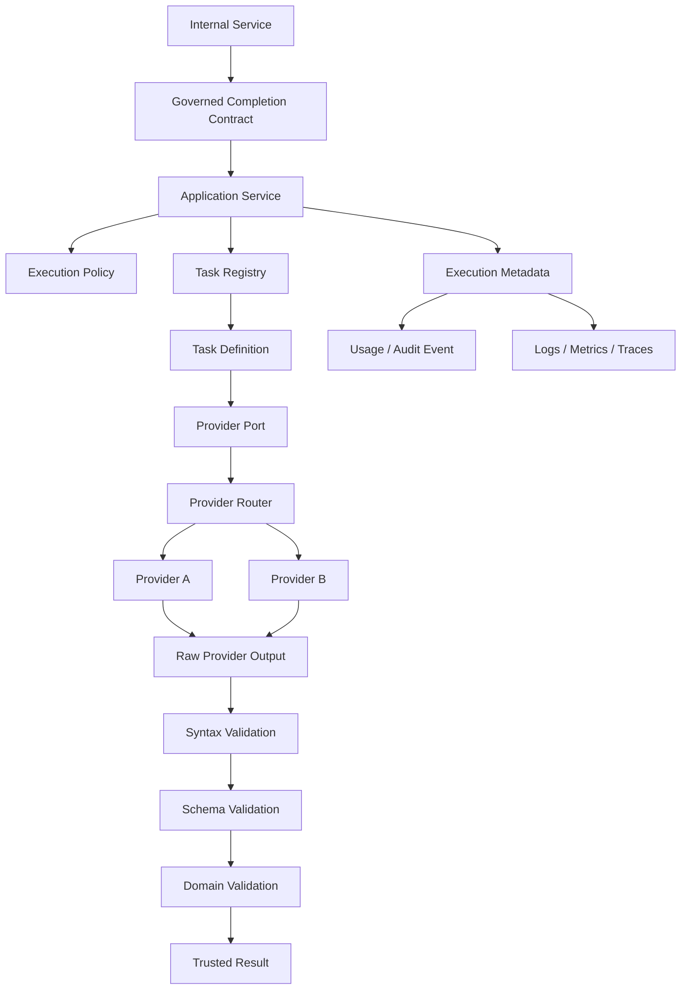

The primary trust boundary is:

```text
external provider response
          ↓
      untrusted data
          ↓
   deterministic validation
          ↓
     trusted result
```

---

# 6. Boundary Model

The gateway has four architectural layers.

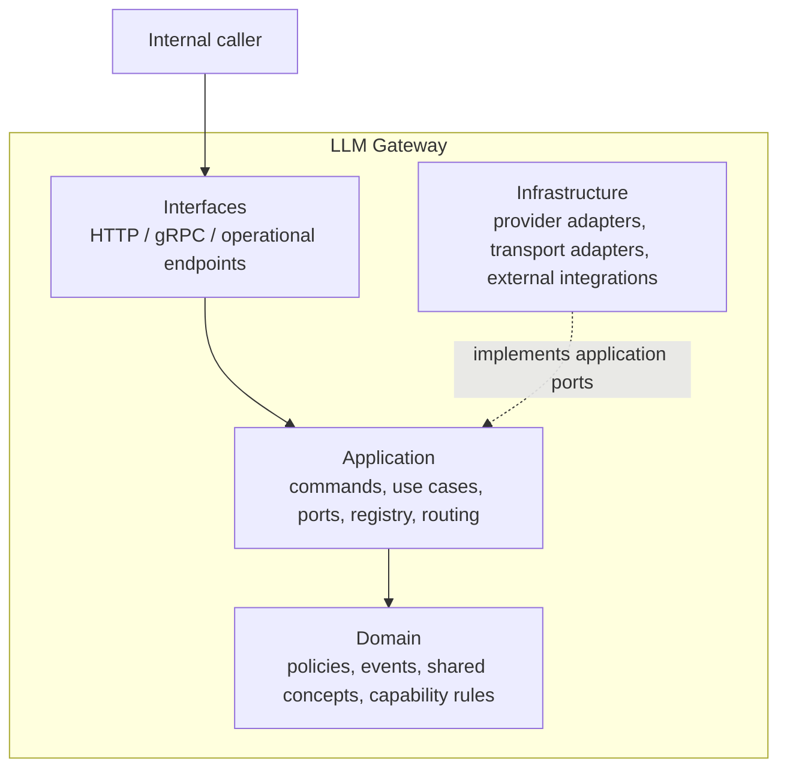

## Domain

Contains business concepts and invariants.

No direct dependency on:

- HTTP handlers;
- gRPC status construction;
- Redis clients;
- Kafka clients;
- PostgreSQL drivers;
- vendor SDKs.

## Application

Coordinates the governed completion use case.

Responsibilities include:

- command validation;
- capability resolution;
- port invocation;
- provider request creation;
- timeout/deadline orchestration;
- provider routing;
- output decoding;
- metadata construction;
- usage publication through an application-owned port.

## Interfaces

Translate external protocol requests into application commands.

## Infrastructure

Implements concrete ports for external dependencies.

---

# 7. Request Identity Semantics

Identity is explicit because the system crosses multiple lifecycle boundaries.

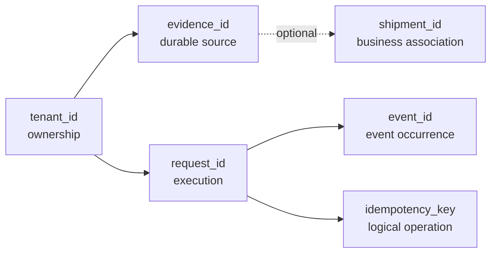

## `tenant_id`

The authorization and isolation boundary.

## `evidence_id`

The durable identity of a business evidence item.

It can outlive an individual AI request and can participate in later enrichment or retrieval.

## `shipment_id`

A business relationship, not a universal parent identity.

## `request_id`

Identifies one execution and supports tracing and diagnosis.

## `idempotency_key`

Identifies one logical operation for duplicate protection.

## `event_id`

Identifies one event occurrence.

The gateway never assumes that one of these identifiers can substitute for another.

---

# 8. Application Contract

The use-case boundary is transport-neutral.

```go
type CompleteCommand struct {
    ContractVersion      string
    TenantID             string
    RequestID            string
    IdempotencyKey       string
    TaskType             domain.TaskType
    TaskSchemaVersion    string
    Prompt               string
    PromptVersion        string
    OutputSchemaVersion  string
    MaxTokens            int
    Deadline              time.Time
    Subjects             []domain.EntityReference
    EvidenceRefs         []domain.EvidenceReference
}
```

The important semantic rules are:

- tenant ownership is explicit;
- request correlation is explicit;
- task capability is controlled;
- task and output schemas are versioned;
- prompt provenance is explicit;
- evidence references are explicit;
- deadlines are explicit;
- provider-specific structures stay outside the application command.

---

# 9. Provider Request Narrowing

The provider adapter sees a smaller contract.

```go
type ProviderRequest struct {
    TaskType            domain.TaskType
    Prompt              string
    PromptVersion       string
    OutputSchemaVersion string
    MaxTokens            int
}
```

The provider does not need the entire application command.

This prevents internal correlation, tenant, idempotency, evidence references, and other execution metadata from becoming accidental vendor payload.

The adapter is responsible for translating this internal provider request into provider-specific API structures and normalizing provider-specific failures into gateway concepts.

---

# 10. Capability Registry

The gateway uses a controlled task registry rather than a giant conditional dispatch block.

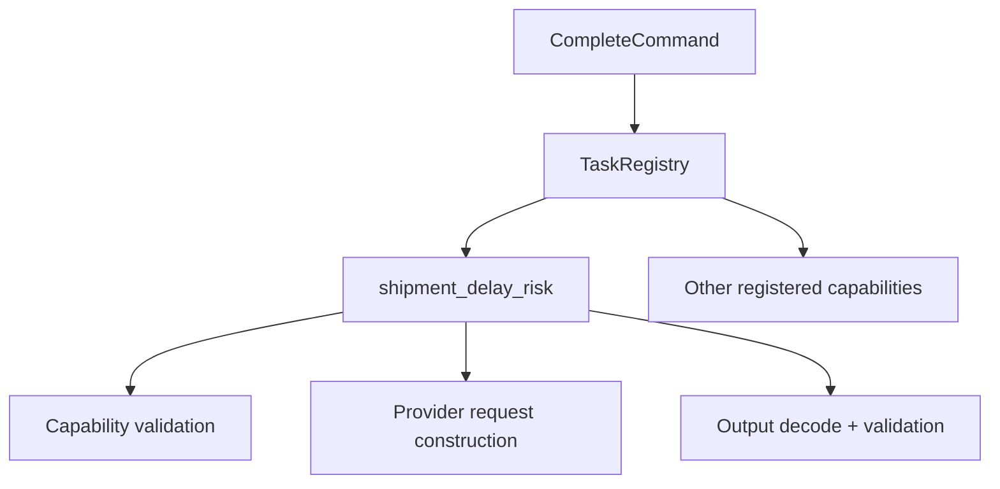

A task definition owns capability-specific behavior.

A conceptual interface is:

```go
type TaskDefinition interface {
    TaskType() domain.TaskType
    TaskSchemaVersion() string
    OutputSchemaVersion() string
    ValidateCommand(CompleteCommand) error
    BuildProviderRequest(CompleteCommand) ProviderRequest
    DecodeAndValidate(
        context.Context,
        CompleteCommand,
        ProviderResponse,
    ) (TaskResult, error)
}
```

The application registry connects a controlled `TaskType` to its definition.

This supports capability growth without embedding shipment-risk rules into the generic gateway model.

---

# 11. Domain Model

The root domain package contains shared gateway vocabulary.

```text
services/llm-gateway/domain/
├── model.go
├── policy.go
├── events.go
├── errors.go
└── shipmentrisk/
    ├── model.go
    └── policy.go
```

## Shared gateway domain

`domain/model.go` contains concepts such as:

- `TaskType`;
- `EntityType`;
- `EntityReference`;
- `EvidenceReference`;
- namespaced execution status;
- namespaced validation status.

Execution outcomes use an explicit `execution_` vocabulary rather than one
catch-all `failed` value:

```text
execution_succeeded
execution_preflight_failed
execution_unsupported_task
execution_provider_failed
execution_validation_failed
execution_request_canceled
execution_deadline_exceeded
```

Validation outcomes use a separate `validation_` vocabulary:

```text
validation_not_run
validation_passed
validation_failed
```

Keeping execution status separate from validation status allows usage events
to record that a provider consumed resources even when its output failed
validation. The explicit prefixes also give dashboards and alerts stable,
non-ambiguous dimensions without parsing error messages.

## Gateway-wide policy

`domain/policy.go` validates execution invariants common to governed gateway operations.
It accepts a domain-owned `ExecutionContext` rather than importing
`application.CompleteCommand`:

```go
type ExecutionContext struct {
    ContractVersion string
    TenantID        string
    RequestID       string
    TaskType        TaskType
    EvidenceRefs    []EvidenceReference
    Now             time.Time
}

func (p ExecutionPolicy) ValidateExecutionContext(ctx ExecutionContext) error
```

`Now` allows future time-based rules without coupling the domain to a clock
interface. `MaxEvidenceReferences` has explicit semantics: a positive value
sets a maximum, zero means no evidence references are allowed, and a negative
value opts into unlimited references. Evidence-reference structure is checked
by the gateway; evidence existence and ownership remain with the evidence
bounded context.

## Usage events

`domain/events.go` defines the business fact that AI execution occurred with measurable operational metadata.

## Capability domain

`domain/shipmentrisk/` owns shipment-risk semantics and invariants.

---

# 12. Shipment-Risk Trust Model

The shipment-risk result is a domain object, not a provider object.

```text
ProviderResponse.RawOutput
            ↓
JSON syntax
            ↓
Output schema
            ↓
Shipment-risk policy
            ↓
shipmentrisk.Result
```

The capability result keeps its explicit type name:

```go
type ShipmentRiskResult struct {
    ShipmentID string
    Risk       Risk
    Confidence float64
    Reasons    []string
}
```

`ShipmentRiskResult.Validate()` owns intrinsic invariants:

- shipment ID must exist;
- risk must be one of the controlled values;
- confidence must be finite and within `[0, 1]`;
- `high_risk` requires non-empty reasons.
- no reason may be blank.

The capability policy delegates to `ShipmentRiskResult.Validate()` and is the
extension point for cross-object rules. For example, verifying that the
returned shipment ID matches the requested subject requires the application
command and therefore remains above the domain result model.

These rules are deterministic and independent of which provider produced the
raw output. A finite-value check occurs before the confidence range check so
`NaN` and infinities cannot bypass numeric validation.

---

# 13. Validation Pipeline

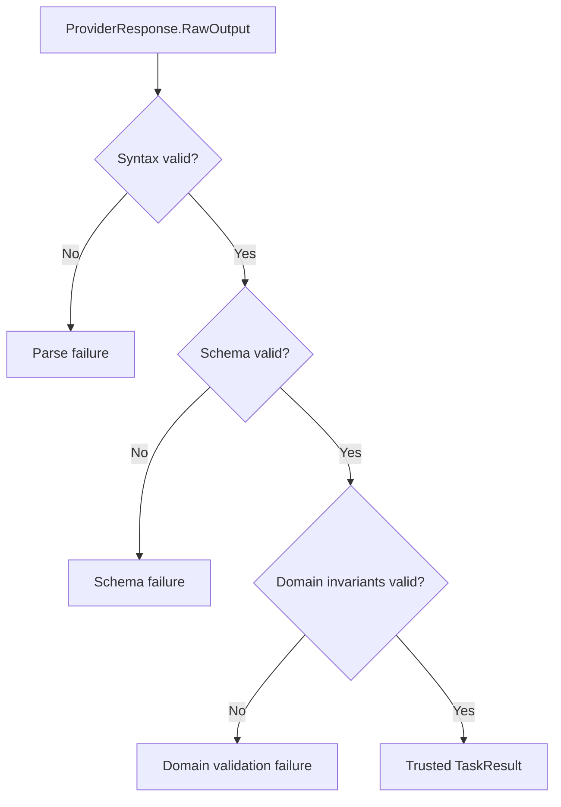

## Syntax validation

Answers:

> Can the raw provider output be parsed according to the expected serialization format?

## Schema validation

Answers:

> Are required fields present with the correct types and structure?

## Domain validation

Answers:

> Does the result represent valid business meaning for this capability?

This separation prevents a single giant validator from hiding responsibility boundaries.

---

# 14. Failure Taxonomy

The gateway distinguishes failures because recovery depends on their meaning.

```text
invalid_argument
unsupported_task
contract_mismatch
request_canceled
deadline_exceeded
provider_timeout
provider_unavailable
provider_rate_limited
provider_bad_request
provider_authentication
validation_failed
internal
```

The domain error taxonomy is transport-neutral. `DomainError` supports
category matching with Go's standard `errors.Is` API while retaining an
underlying cause for diagnostics:

```go
if errors.Is(err, &domain.DomainError{
    Kind: domain.KindValidationFailed,
}) {
    // Handle the validation-failure category.
}
```

Provider timeout is not a separate application error kind. The application
reports caller or effective-deadline exhaustion as `deadline_exceeded`, and
provider routing exhaustion as `provider_unavailable`.

A provider error is not the same thing as a successful provider response that fails validation.

```text
provider timeout
    ↓
operational failure
    ↓
retry / fallback candidate
```

versus:

```text
valid transport response
    ↓
invalid business output
    ↓
validation failure
    ↓
no trusted result
```

---

# 15. Provider Router

The router composes providers behind the same application port.

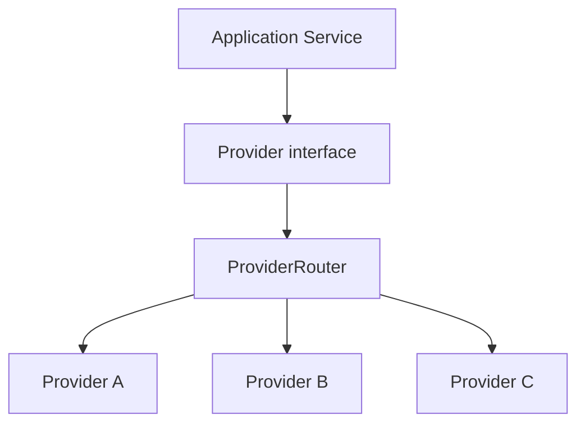

The router is intentionally inside the application execution boundary because it decides how to safely invoke an external dependency using operational rules.

It does not decide whether a logistics result is business-correct.

---

# 16. Router Reliability Rules

The router applies four constraints simultaneously:

1. provider order;
2. attempt count;
3. per-attempt timeout;
4. parent request deadline.

### Deterministic provider order

```text
Provider A
    ↓
Provider B
    ↓
Provider C
```

The router does not select an arbitrary provider at runtime without explicit policy.

### Bounded attempts

```text
maximum attempts per provider
        +
maximum eligible providers
        =
bounded execution
```

### Attempt timeout

A router-owned attempt timeout creates a child context.

```go
attemptCtx, cancel := context.WithTimeout(parent, attemptTimeout)
defer cancel()
```

The child context can shorten the operation but cannot extend the caller's deadline.

### Attempt-timeout distinction

Plain `context.DeadlineExceeded` can represent two different situations:

```text
router attempt budget expired
```

or:

```text
caller request deadline expired
```

The router uses an explicit `AttemptTimeoutError` boundary so its own timeout does not get mistaken for caller exhaustion.

---

### Provider Circuit Breaker

The provider router may incorporate a provider-scoped circuit breaker so repeated operational failures stop consuming request and provider resources while a dependency is unhealthy.

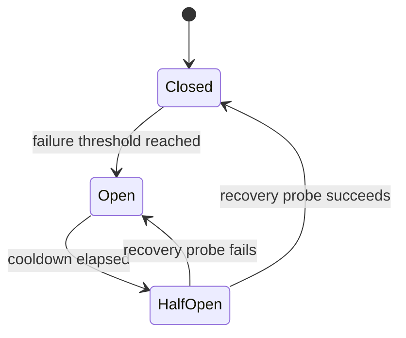

The breaker is independent per provider. A failure in Provider A must not automatically disable Provider B. A fallback decision still passes through the normal policy checks and ultimately through the same validation pipeline.

The breaker state is operational state, not business truth. It should therefore live in an explicit infrastructure/application boundary rather than inside domain packages.

# 17. Retry Policy

Default retry candidates are operational failures:

```text
temporary unavailability
rate limiting
transient server failure
router-owned attempt timeout
```

Default non-retryable conditions are:

```text
caller cancellation
caller deadline exhaustion
authentication failure
invalid request
unsupported operation
```

The exact classifier belongs to the provider/application boundary and should not rely on brittle string matching.

Bad:

```go
if strings.Contains(err.Error(), "429") {
    // retry
}
```

Better:

```go
type ProviderFailureKind string

const (
    FailureUnavailable    ProviderFailureKind = "unavailable"
    FailureRateLimited    ProviderFailureKind = "rate_limited"
    FailureServerError    ProviderFailureKind = "server_error"
    FailureAuthentication ProviderFailureKind = "authentication"
    FailureInvalidRequest ProviderFailureKind = "invalid_request"
)
```

The adapter translates provider-specific errors into these stable concepts.

---

# 18. Fallback Policy

Fallback means changing provider; retry means repeating the same provider call.

```text
Retry:

Provider A
   ↓ failure
Provider A
   ↓ failure
stop
```

```text
Fallback:

Provider A
   ↓ failure
Provider B
```

Fallback is eligible for operational failures that the routing policy recognizes.

A successful provider response that fails semantic validation does not automatically trigger another vendor call.

Why:

- additional cost;
- additional latency;
- possible semantic drift;
- quality problems become harder to measure;
- a second plausible answer can mask a model defect.

A task-specific evaluation policy can intentionally choose another behavior, but that decision must remain explicit rather than appearing as accidental router behavior.

---

# 19. Caller Deadline Semantics

The request has a deadline hierarchy.

```text
caller context deadline
        │
        ├── authoritative upper bound
        │
        ▼
command deadline
        │
        ▼
effective application deadline
        │
        ▼
provider attempt timeout
```

The effective deadline is the earliest valid bound.

Never:

```text
caller deadline = 2s
attempt timeout = 5s
```

and then allow the provider to consume five seconds.

The caller's context remains authoritative.

---

# 20. Application Service Pipeline

The service behaves as a stateless orchestration coordinator.

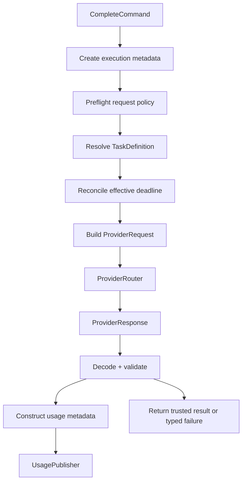

The service does not persist business state in a database as part of the core completion path.

---

### Target Infrastructure Request Flow

The application pipeline above is transport-neutral. When the planned infrastructure integrations are enabled, the complete runtime path is:

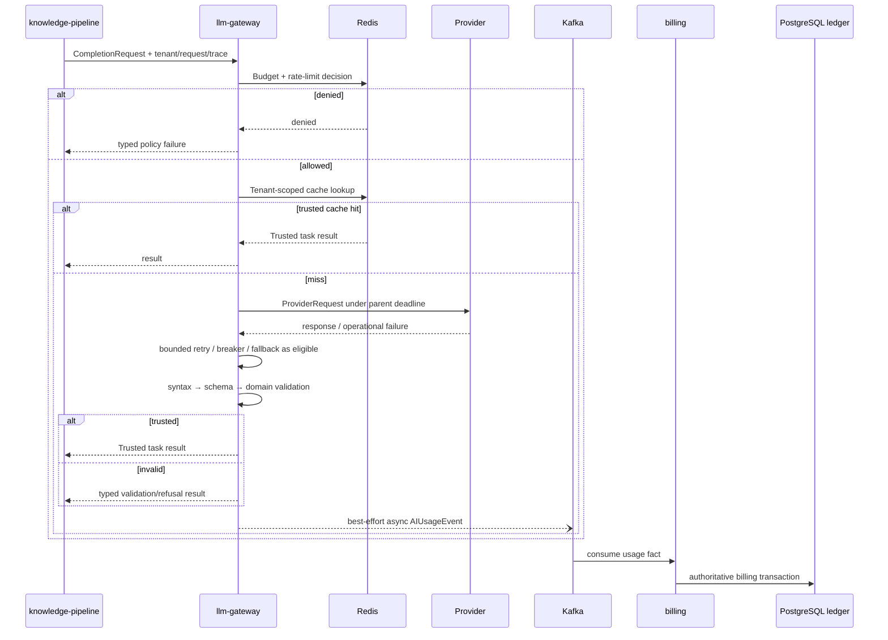

The usage publication shown above is a non-blocking best-effort bridge in the current gateway implementation. Event construction and validation happen before dispatch; the publisher call runs in a goroutine with caller cancellation and deadlines removed while preserving context values such as tracing metadata. A failed publication is intentionally not returned to the business caller. The bridge is not a durability guarantee: production-grade delivery requires an outbox or durable Kafka producer with at-least-once semantics and reconciliation.

The exact production state model may evolve, but the ownership boundaries do not: Redis is shared operational state, Kafka is an event boundary, and the billing database remains owned by billing rather than by the LLM Gateway.

# 21. Execution Metadata

Execution metadata separates latency and provider usage from the trusted business result.

Representative fields include:

```text
request_id
provider
model
prompt_version
task_type
execution_status
validation_status
provider_latency_ms
validation_latency_ms
total_gateway_latency_ms
input_tokens
output_tokens
total_tokens
estimated_cost_usd
retry_count
```

This makes the system diagnosable without storing raw model content in operational telemetry.

---

# 22. Usage Event Contract

`AIUsageEvent` is a business-safe execution fact.

```text
AIUsageEvent
├── event_id
├── event_version
├── tenant_id
├── request_id
├── task_type
├── provider
├── model
├── input_tokens
├── output_tokens
├── total_tokens
├── estimated_cost_usd
├── attempts
├── execution_status
├── validation_status
└── occurred_at
```

The event intentionally excludes:

```text
prompt
completion body
document body
retrieved context
credentials
secrets
```

A provider may consume tokens even when validation later fails.

Therefore usage metadata and validation status are separate dimensions.

```text
provider executed
      ↓
resource consumed
      ↓
validation failed
```

The execution fact remains auditable.

Before publication, the domain validates the event contract. It rejects
whitespace-only required strings, missing execution or validation status,
negative token counts, inconsistent token arithmetic, non-finite or negative
estimated cost, negative attempt counts, and a zero occurrence time:

```text
total_tokens = input_tokens + output_tokens
estimated_cost_usd is finite and >= 0
attempts >= 0
```

The domain event intentionally has no JSON serialization tags. Wire encoding
belongs to the infrastructure adapter, so the same domain fact can be sent
through Kafka, Protobuf, or another transport without coupling the domain to
one representation.

---

# 23. Telemetry Publication Boundary

The domain defines the event shape; the domain does not publish it.

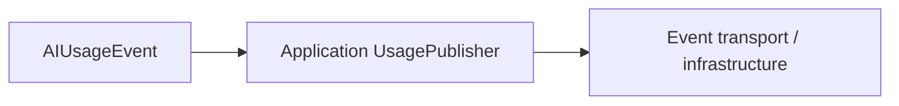

This preserves dependency direction.

The application constructs and validates the event synchronously, then dispatches it through a best-effort asynchronous bridge:

```text
event construction / validation
          ↓
context.WithoutCancel(parent context)
          ↓
goroutine → UsagePublisher.PublishUsageEvent(...)
          ↓
publisher error intentionally discarded
```

The bridge has these guarantees and limits:

- it never returns a publication error to the completion caller;
- a missing publisher, event-ID failure, or event-validation failure drops the event;
- caller cancellation and deadlines do not cancel the background publication, while context values remain available for tracing and scoping;
- publication is not durable and may be lost if the process exits before the goroutine completes.

The hot completion path therefore does not couple business-result latency to publisher I/O or an external billing database. This seam must eventually be replaced or backed by an outbox or durable Kafka producer when billing requires at-least-once delivery.

Best-effort asynchronous delivery is not equivalent to durable at-least-once delivery or exactly-once accounting. Durable event delivery requires an infrastructure-level durability mechanism and reconciliation process.

---

# 24. Logs, Metrics, Traces, Events

These signals serve different purposes.

| Signal  | Primary purpose              | Example                                  |
| ------- | ---------------------------- | ---------------------------------------- |
| Logs    | diagnostic narrative         | provider timeout for request             |
| Metrics | aggregate operational health | fallback rate                            |
| Traces  | end-to-end causality         | caller → gateway → provider → validation |
| Events  | business/audit fact          | AI usage for tenant/request              |

A useful mental model is:

```text
Log    = what happened?
Metric = how often / how much?
Trace  = where did it happen?
Event  = what business fact occurred?
```

---

# 25. Metric Contract

The gateway's metric vocabulary is intentionally low-cardinality.

```text
llm_gateway_requests_total
llm_gateway_request_duration_seconds
llm_gateway_provider_requests_total
llm_gateway_provider_latency_seconds
llm_gateway_provider_failures_total
llm_gateway_fallback_total
llm_gateway_validation_failures_total
llm_gateway_budget_denied_total
llm_gateway_cache_hits_total
llm_gateway_estimated_cost_usd_total
```

Recommended low-cardinality labels:

```text
provider
model
task_type
status
failure_class
```

Avoid putting the following into ordinary Prometheus labels:

```text
tenant_id
request_id
evidence_id
prompt
full document content
```

Prometheus documents that every unique label combination becomes a distinct time series and specifically warns against high-cardinality labels such as unbounded IDs. citeturn922623search0turn922623search15

---

# 26. Tracing Contract

A gateway request is represented as a trace with meaningful child operations.

```text
llm.gateway.request
    ├── policy.check
    ├── task.resolve
    ├── provider.route
    ├── provider.attempt
    ├── provider.retry
    ├── provider.fallback
    ├── validation
    └── result
```

The trace context crosses service boundaries through standard propagation mechanisms. OpenTelemetry defines common semantic conventions across traces, metrics, logs, events, and resources to make telemetry consistent across different languages and services. citeturn922623search1turn922623search2

Sensitive prompts and evidence are not default span attributes.

---

# 27. Security Architecture

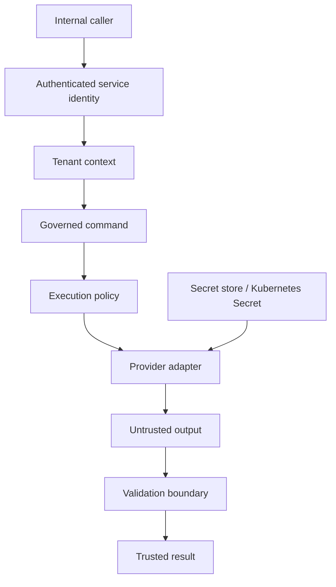

Security rules:

1. tenant identity is part of the governed request context;
2. provider credentials never cross into upstream business services;
3. secrets are externalized from source code;
4. raw prompts/completions are not default telemetry payloads;
5. provider outputs are treated as hostile external data;
6. response size limits protect memory and resource usage;
7. runtime containers use least privilege;
8. network access is explicitly controlled.

---

# 28. Kubernetes Runtime Design

The gateway is packaged as a thin Helm chart and follows the platform's standard runtime contract.

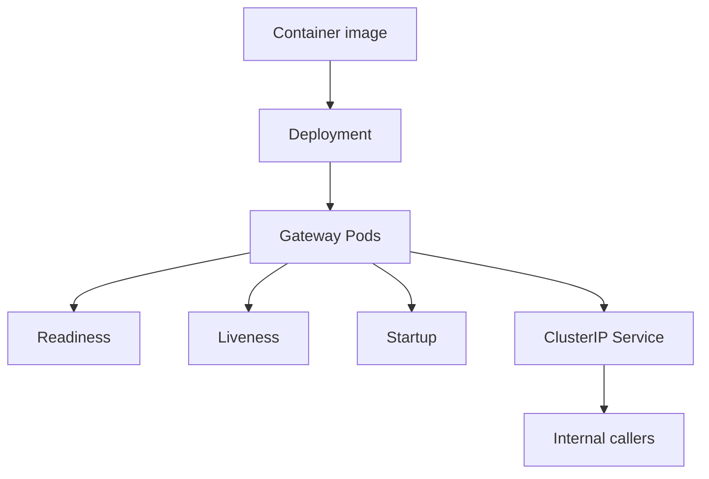

Container expectations:

```text
PORT=8080 by default
/healthz
/startupz
/live
non-root
read-only filesystem
restricted Linux capabilities
resource requests + limits
```

The internal service uses Kubernetes Service discovery rather than exposing the gateway directly to the public internet. External L7 routing belongs at an edge boundary where TLS, authentication, and traffic policy are actually required.

---

# 29. Helm And GitOps

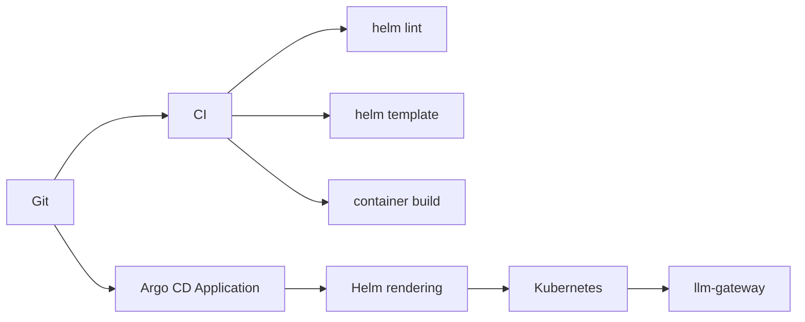

Argo CD applications can be defined declaratively as Kubernetes manifests, keeping the desired deployment state version-controlled and reconcilable. citeturn922623search14

The release model separates:

```text
repository correctness
        ↓
artifact correctness
        ↓
deployment desired state
        ↓
cluster reconciliation
        ↓
runtime health
```

---

# 30. Configuration And Secrets

Configuration has a deliberate separation.

### Normal configuration

Examples:

```text
PORT
LOG_LEVEL
DEFAULT_TIMEOUT
MAX_TOKENS
ENVIRONMENT
```

### Secret configuration

Examples:

```text
provider API keys
Redis credentials
private repository credentials
other protected credentials
```

Secrets are referenced by deployment mechanisms rather than committed as plaintext application configuration.

---

# 31. State And Consistency

The gateway application process is stateless.

```text
Gateway replica A
Gateway replica B
Gateway replica C
       │
       └── same application contract
```

Durable business state belongs outside the process.

Shared operational state such as distributed rate limits, budget counters, or caches belongs behind explicit application ports rather than hidden globals.

A local process must not become the authoritative owner of tenant-level business state.

---

# 32. Cost Control Boundary

Cost controls are distinct concerns.

```text
Rate limit
   = protects request volume

Budget
   = protects spend

Cache
   = avoids repeated work
```

A conceptual execution boundary is:

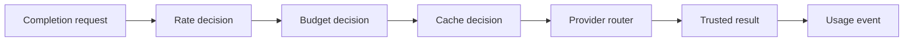

The key invariant is that expensive provider work should not happen before mandatory business controls have allowed the operation.

---

### Distributed Rate Limiting, Provider Quotas, and Redis Consistency

The target gateway uses two distinct rate-control layers:

1. **Tenant rate limiting** protects LogiFlow resources and enforces fairness across gateway replicas.
2. **Provider quota control** protects external provider limits and may use a configured pool of authorized credentials or accounts only where policy and provider terms permit such pooling.

A token bucket can be represented by capacity `C` and refill rate `R`. The refill and decrement must be performed atomically in shared state to avoid multiple gateway replicas authorizing the same logical capacity.

Retries are provider operations too. They must not bypass tenant budgets or provider quotas.

### Redis failure policy

Budget enforcement is the stronger consistency boundary because it controls spend. When the authoritative Redis write path is unavailable, the target policy is fail closed rather than silently authorizing new external spend.

Conceptually:

```text
budget state unavailable
        ↓
no safe authorization decision
        ↓
reject with infrastructure / resource-exhausted semantics
```

A different availability posture may be acceptable for non-critical cache reads, where a stale value can be preferable to a failed request. That distinction must be explicit; cache availability policy must not leak into financial authorization policy.

Standard Redis replicas should not be treated as writable coordination nodes. Atomic budget decrements and rate-limit updates must execute against the authoritative write path.

# 33. Cache Safety

Any LLM response cache must be tenant-aware and behavior-aware.

A conceptual cache key is:

```text
llm:cache:
  tenant_id:
  task_type:
  task_schema_version:
  prompt_version:
  output_schema_version:
  request_fingerprint:
```

The cache must not become a hidden source of truth for business evidence.

Cache correctness depends on:

- tenant isolation;
- version compatibility;
- model/provider semantics;
- invalidation policy;
- expiration policy;
- sensitive-content handling.

---

# 34. Concurrency Model

Provider calls are network-bound operations and can occupy resources for a long time relative to ordinary in-process functions.

The gateway protects itself using:

```text
context cancellation
per-attempt timeout
bounded retries
bounded provider attempts
resource limits
explicit concurrency boundaries
```

A cancellation-aware sleep is required for retry backoff so the router does not continue sleeping after the parent request has expired.

Conceptually:

```go
func sleep(ctx context.Context, d time.Duration) error {
    timer := time.NewTimer(d)
    defer timer.Stop()

    select {
    case <-ctx.Done():
        return ctx.Err()
    case <-timer.C:
        return nil
    }
}
```

The exact implementation can use deterministic zero-delay behavior in unit tests while preserving context-aware production semantics.

---

### Goroutine and In-Flight Work Protection

Go cancellation does not forcibly kill a goroutine; it works when the provider client observes the context and returns. The gateway therefore combines context propagation with explicit concurrency limits and response-size bounds.

Recommended controls in the target implementation include:

- maximum concurrent provider calls per instance;
- bounded request and response bodies;
- bounded retry attempts and retry budgets;
- cancellation-aware backoff;
- metrics for in-flight provider calls and timeout rates;
- caller-side worker limits for asynchronous processing systems.

A retry backoff must itself be cancellation-aware:

```go
func sleep(ctx context.Context, d time.Duration) error {
    timer := time.NewTimer(d)
    defer timer.Stop()

    select {
    case <-ctx.Done():
        return ctx.Err()
    case <-timer.C:
        return nil
    }
}
```

# 35. Failure Matrix

| Failure                    | Owning boundary       | Default behavior            |
| -------------------------- | --------------------- | --------------------------- |
| missing tenant             | application/domain    | reject                      |
| missing request ID         | application           | reject                      |
| unsupported task           | registry/application  | reject                      |
| contract mismatch          | application/domain    | reject                      |
| budget denied              | cost-control boundary | reject                      |
| gateway rate-limited       | cost-control boundary | reject                      |
| provider timeout           | router/provider       | retry candidate             |
| provider unavailable       | router/provider       | retry/fallback candidate    |
| provider rate-limited      | router/provider       | retry/fallback candidate    |
| provider 5xx               | router/provider       | retry/fallback candidate    |
| authentication failure     | provider adapter      | stop                        |
| invalid provider request   | provider adapter      | stop                        |
| caller cancellation        | context               | stop immediately            |
| caller deadline            | context               | stop immediately            |
| malformed JSON             | validation            | reject                      |
| wrong schema               | validation            | reject                      |
| confidence outside `[0,1]` | domain capability     | reject                      |
| high-risk without reason   | domain capability     | reject                      |
| mismatched shipment ID     | domain capability     | reject                      |
| all providers exhausted    | router                | deterministic typed failure |

---

# 36. Failure-Driven Test Design

The strongest tests are behavioral rather than implementation-specific.

## Provider reliability

```text
primary success
primary timeout → retry
primary unavailable → fallback
primary rate limited → fallback
non-retryable error → stop
all providers fail → typed failure
```

## Deadline behavior

```text
attempt timeout < caller deadline
    → attempt expires
    → retry remains possible

caller deadline expires
    → router stops immediately
```

## Trust behavior

```text
invalid JSON
    → parse failure

valid JSON / wrong fields
    → schema failure

valid schema / invalid business value
    → domain failure
```

## Privacy behavior

```text
prompt present in request
    → metadata/event contains no prompt body
```

---

# 37. Testing Pyramid And Evidence

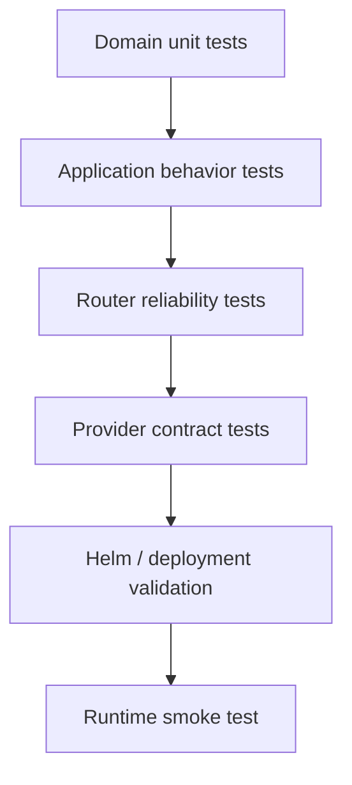

Each level proves a different claim.

| Test level    | Proof                                     |
| ------------- | ----------------------------------------- |
| domain        | invariant correctness                     |
| application   | use-case behavior                         |
| provider fake | deterministic external failure simulation |
| router        | bounded recovery semantics                |
| deployment    | chart correctness                         |
| smoke         | runtime startup/readiness/health          |

---

## Communication Choices

### Why gRPC for completion requests?

The caller needs a typed AI result before it continues its workflow. gRPC provides a small, explicit request/response boundary with generated contracts, deadline propagation, and stable status semantics.

### Why Kafka for usage events?

Usage and billing reconciliation do not need to block the completion response. The current gateway exposes an application-owned `UsagePublisher` port and invokes it asynchronously so publisher I/O and errors do not extend or fail the user-facing request. A production Kafka implementation should provide durable acceptance, at-least-once delivery, replay, and reconciliation independently of the completion response; the current goroutine is only the minimal bridge to that future infrastructure.

### Why not write the billing ledger directly from the gateway hot path?

Synchronous PostgreSQL billing writes add transaction latency, connection-pool pressure, and financial-database availability to every AI request. The target design keeps the authoritative ledger in the billing service and moves accounting off the completion path through a durable usage event.

# 38. Build And Runtime Validation

Repository validation:

```bash
go test ./...
go test -race ./...
go vet ./...
git diff --check
```

Gateway validation:

```bash
cd services/llm-gateway
go test ./...
```

Helm validation:

```bash
helm lint deployment/helm/services/llm-gateway
helm template llm-gateway deployment/helm/services/llm-gateway
```

Container validation:

```bash
docker build \
  -f build/Dockerfile.llm-gateway \
  -t logiflow/llm-gateway:local .
```

Local Kubernetes validation:

```bash
kind load docker-image logiflow/llm-gateway:local --name logiflow-dev
helm upgrade --install llm-gateway-dev \
  deployment/helm/services/llm-gateway \
  -f deployment/helm/services/llm-gateway/values-dev.yaml \
  --set image.tag=local \
  --namespace logiflow-dev \
  --create-namespace
kubectl get pods -n logiflow-dev
```

---

# 39. Observability Ownership Map

```text
Application Service
   │
   ├── request metadata
   ├── task type
   ├── prompt/version metadata
   ├── result status
   └── total latency
        │
        ├────────────── ProviderRouter
        │                  ├── attempt count
        │                  ├── provider
        │                  ├── provider latency
        │                  └── fallback outcome
        │
        └────────────── Validation
                           ├── syntax latency
                           ├── schema latency
                           └── domain latency
```

This decomposition lets an operator distinguish:

```text
provider problem
vs
internal validation problem
vs
application contract problem
vs
Kubernetes/runtime problem
```

---

# 40. Latency Accounting

The service records decomposed latency rather than one opaque duration.

```text
Total Gateway Latency
       │
       ├── policy / routing overhead
       ├── provider latency
       ├── retry/fallback time
       └── validation latency
```

A simplified diagnostic interpretation:

```text
high provider latency
+ low validation latency
= external dependency problem
```

```text
low provider latency
+ high validation latency
= internal processing problem
```

This decomposition is more actionable than a single end-to-end histogram.

---

# 41. Privacy-Safe Telemetry

Telemetry must not become an accidental shadow database for sensitive evidence.

Do not log or metric:

```text
raw prompt
full document
full completion
retrieved chunks
API keys
authorization headers
secret values
```

Safe metadata examples:

```text
request_id
trace_id
provider
model
task_type
prompt_version
status
failure_class
duration
usage counts
estimated cost
```

Detailed per-request payload debugging belongs in tightly controlled diagnostic tooling, not general-purpose telemetry.

---

# 42. Deployment And Availability Model

The service is designed to run as multiple interchangeable replicas.

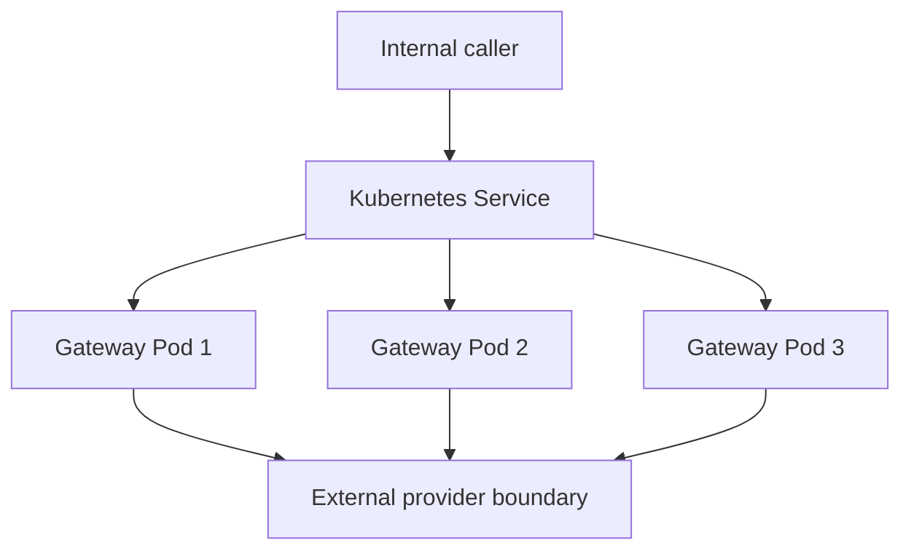

Readiness controls whether a pod receives traffic.

Liveness detects a process that is no longer functioning correctly.

Startup protects slower initialization paths from premature liveness failure.

The service does not rely on a local process cache as the authoritative source of shared tenant state.

---

### Implementation Boundary

The repository currently provides the deployable service scaffold and the policy-oriented application/test structure described in the earlier sections. The following distinction is intentional:

### Current runtime evidence

- composition root and HTTP health endpoints;
- container image build;
- Helm chart and environment values;
- security context, resources, and probes;
- typed request/error/validation behavior where implemented by the current service code;
- local deployment and smoke-test evidence.

### Target integrations

- gRPC completion adapters and generated protobuf contracts;
- real provider adapters;
- Redis budgets, rate limits, cache, and distributed operational state;
- Kafka usage-event publication;
- provider circuit breakers and fallback routing;
- end-to-end trace propagation and production telemetry export.

The system design is intentionally forward-looking, but implementation claims should always be checked against the service source tree and current deployment manifests.

# 43. Design Decision Register

## ADR-011 — Governed Generic Completion Contract

### Context

Multiple internal AI capabilities need a common application boundary.

### Decision

Use a governed `CompleteCommand` with explicit task identity, versioning, subject references, evidence references, deadlines, and execution identity.

### Rationale

- one stable use-case boundary;
- capability-specific validation stays behind the registry;
- protocol adapters do not invent separate contracts;
- provider adapters remain isolated from callers.

### Trade-off

The command contains fields not every capability uses, so task definitions must validate capability-specific constraints.

---

## ADR-012 — Explicit Identity Vocabulary

### Context

Evidence, shipment, request, event, and idempotency identities have different semantics.

### Decision

Use explicit:

```text
tenant_id
evidence_id
shipment_id
request_id
idempotency_key
event_id
```

### Rationale

Explicit vocabulary reduces accidental authorization, correlation, cache, and event-key mistakes.

### Trade-off

More verbose contracts, but less semantic ambiguity.

---

## ADR-013 — Domain Policy And Privacy-Safe Usage Events

### Context

The gateway needs pre-execution guardrails and post-execution usage facts.

### Decision

Keep gateway-wide invariants in `domain/policy.go` and usage/audit event definitions in `domain/events.go`. Publication remains an application concern.

### Event safety

The event contains metadata such as tenant, request, task, provider, model, tokens, estimated cost, status, validation outcome, and timestamp, but excludes raw prompt and evidence content.

### Rationale

The business can attribute and audit AI activity without spreading sensitive model inputs across infrastructure.

### Trade-off

Metadata-only events improve privacy but reduce payload-level debugging context; detailed diagnosis requires controlled traces/logs.

---

## ADR-014 — Capability-Specific Domain Packages

### Context

The gateway serves multiple AI capabilities with different business invariants.

### Decision

Place meaningful capability-specific business models and policies below the domain package, such as `domain/shipmentrisk/`.

### Rationale

The shared gateway domain stays small while business truth remains close to the capability that owns it.

### Trade-off

The registry and application layer become more important because capability dispatch is no longer encoded in one central model.

---

## ADR-015 — Provider Router, Bounded Retry, Timeout, And Fallback

### Context

External model providers are distributed dependencies that can time out, become unavailable, return rate-limit responses, or fail transiently.

### Decision

Use an application-owned `ProviderRouter` that:

1. invokes providers in deterministic order;
2. bounds attempts;
3. applies per-attempt timeouts;
4. preserves the parent deadline;
5. retries only classified operational failures;
6. falls back only to eligible providers;
7. preserves raw provider output for the existing trust pipeline;
8. does not automatically turn semantic validation failures into additional provider spend.

### Rationale

This adds reliability without changing the application contract or moving operational policy into business-domain objects.

### Trade-off

Retries and fallback can increase latency and cost and can change provider/model behavior. Therefore recovery is bounded and observable.

---

The old HLD's infrastructure decisions remain part of the architecture contract: synchronous completion is separated from asynchronous accounting; Redis enforces shared hot-path controls; billing owns the authoritative ledger; provider reliability is isolated from domain correctness; and fallback results re-enter the same trust pipeline as primary results.

# 44. Architecture Trade-Off Matrix

| Decision area        | Chosen approach               | Why                                   | Main trade-off                               |
| -------------------- | ----------------------------- | ------------------------------------- | -------------------------------------------- |
| Gateway form         | dedicated service             | governance + independent scaling      | network hop                                  |
| Domain style         | DDD + ports/adapters          | framework/vendor independence         | more structure                               |
| Provider contract    | raw response                  | preserves trust boundary              | validation complexity in application         |
| Task dispatch        | registry                      | extensibility                         | registry lifecycle                           |
| Provider reliability | router                        | bounded recovery                      | recovery can cost more                       |
| Retry policy         | explicit classification       | predictable recovery                  | provider adapters need normalization         |
| Timeout              | child context under parent    | protects end-to-end SLA               | aggressive timeout can reduce success        |
| Usage events         | metadata-only                 | privacy and FinOps                    | payload-level debugging needs other signals  |
| Application state    | stateless                     | scaling and restart simplicity        | shared state needs external controls         |
| Cache key            | tenant + behavior fingerprint | isolation + correctness               | invalidation complexity                      |
| CI                   | code + Helm validation        | catches regressions before deployment | adds PR time                                 |
| GitOps               | declarative reconciliation    | drift control + rollback              | controller operational complexity            |
| Telemetry            | structured, low-cardinality   | scalable diagnosis                    | per-request detail is not carried by metrics |

---

# 45. Runtime Ownership Map

```text
Business evidence
    ↓
Evidence / ingestion boundary

AI execution request
    ↓
LLM Gateway

Model execution
    ↓
Provider adapters

Trusted AI result
    ↓
Calling business service / workflow

Financial authority
    ↓
Billing system

Telemetry
    ↓
Observability systems

Deployment state
    ↓
Git + Helm + Argo CD + Kubernetes
```

The gateway connects these systems; it does not absorb ownership from them.

---

# 46. Engineering Invariants

The following invariants are stronger than implementation details.

### Invariant 1 — Tenant ownership is explicit

A governed AI request has an explicit tenant boundary.

### Invariant 2 — Evidence and execution are different objects

`evidence_id` is not `request_id`.

### Invariant 3 — Capability is explicit

The gateway never infers a governed capability from arbitrary prompt text.

### Invariant 4 — Provider output is untrusted

A provider cannot manufacture a trusted domain result merely by returning JSON.

### Invariant 5 — Invalid AI output is not silently repaired

The platform preserves failures as failures.

### Invariant 6 — Caller deadline is authoritative

A child timeout never extends the caller's deadline.

### Invariant 7 — Recovery is bounded

Retry/fallback has finite limits.

### Invariant 8 — Operational failure and semantic invalidity are different

Provider availability does not define business correctness.

### Invariant 9 — Telemetry is privacy-aware

Observability does not become an ungoverned copy of sensitive AI input.

### Invariant 10 — Deployment state is reproducible

Runtime configuration and desired deployment state are version-controlled and validated.

---

# 47. Design Review Checklist

A gateway change is architecturally complete when reviewers can answer all of these questions:

### Business

- What business decision does this capability support?
- What evidence does it rely on?
- Which system owns the underlying truth?

### Domain

- What invariant is being protected?
- Is the invariant generic gateway policy or capability-specific business policy?

### Application

- What use case is being orchestrated?
- Which port represents the external dependency?
- Where does validation occur?

### Provider

- What provider failures are retryable?
- What provider failures are terminal?
- What exactly can trigger fallback?

### Reliability

- What is the caller deadline?
- What is the attempt budget?
- How is cancellation propagated?

### Security

- What is the tenant boundary?
- What data reaches the provider?
- What data reaches logs/events/metrics?

### Operations

- Which metric detects the problem?
- Which trace shows the path?
- Which runbook explains recovery?

### Delivery

- Does Go CI pass?
- Does Helm lint pass?
- Does Helm render successfully?
- Can the runtime become Ready?
- Is rollback represented as a Git change?

---

# 48. Implementation Roadmap

The design can be implemented incrementally without changing the bounded context:

1. Complete the transport contract and generated gRPC request/response/error bindings.
2. Finish the domain and application tests around task contracts, typed failures, and trust promotion.
3. Add concrete provider adapters with strict context deadlines, response-size limits, and normalized failure kinds.
4. Add Redis-backed tenant budgets and rate limiting with atomic operations.
5. Add tenant-scoped semantic caching with explicit version compatibility and expiration policy.
6. Add provider-scoped circuit breakers, bounded retry/backoff, and deterministic eligible fallback.
7. Replace the best-effort asynchronous usage-event bridge with durable outbox/Kafka publication and billing reconciliation, preserving the non-blocking completion contract.
8. Complete W3C trace propagation, provider latency metrics, validation metrics, and privacy-safe logs.
9. Add integration, resilience, load, security, and failure-injection tests.
10. Promote immutable images through the existing Helm/GitOps environment strategy.

The implementation order intentionally follows:

```text
contract
  ↓
trust / validation
  ↓
reliability
  ↓
shared state + accounting
  ↓
observability
  ↓
scale / optimization
```

This prevents optimization work such as caching or provider pooling from becoming a substitute for correct ownership, validation, and failure semantics.

# 49. Summary

The central architecture is:

```text
                  LOGIFLOW AI EXECUTION

Internal caller
      │
      ▼
CompleteCommand
      │
      ▼
Application Service
      │
      ├── Execution Policy
      ├── Task Registry
      ├── Provider Router
      │       ├── Provider A
      │       └── Provider B
      │
      ▼
Raw Provider Output
      │
      ├── Syntax
      ├── Schema
      └── Domain Validation
              │
              ▼
       Trusted Domain Result
              │
       ┌──────┴────────┐
       ▼               ▼
Usage Metadata     Observability
       │               │
       ▼               ▼
Audit / FinOps    Logs / Metrics / Traces
```

The strongest system-design property is the separation of concerns:

```text
business truth
      ≠
provider execution
      ≠
validation
      ≠
reliability
      ≠
telemetry
      ≠
deployment
```

Each concern has one owner, a small interface, explicit invariants, deterministic tests, and a clear operational boundary.

---

# 50. References

- OpenTelemetry Semantic Conventions: https://opentelemetry.io/docs/specs/semconv/
- Prometheus Naming and Labels: https://prometheus.io/docs/practices/naming/
- Kubernetes: https://kubernetes.io/docs/
- Argo CD Declarative Setup: https://argo-cd.readthedocs.io/en/latest/operator-manual/declarative-setup/
- System Design Primer: https://github.com/donnemartin/system-design-primer
