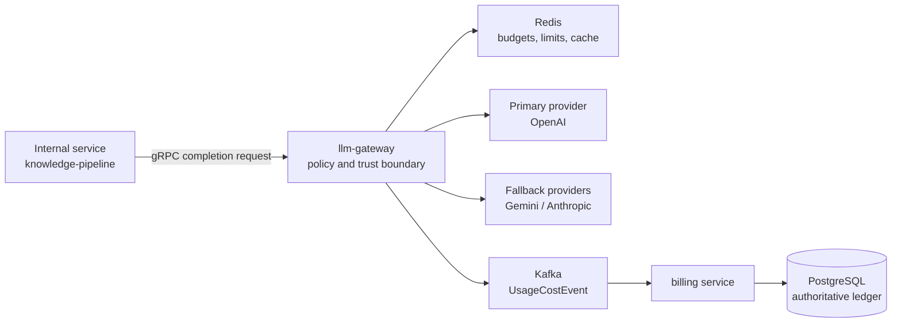
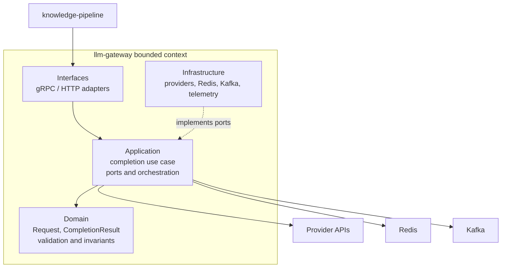
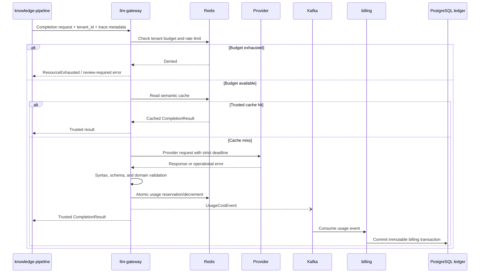
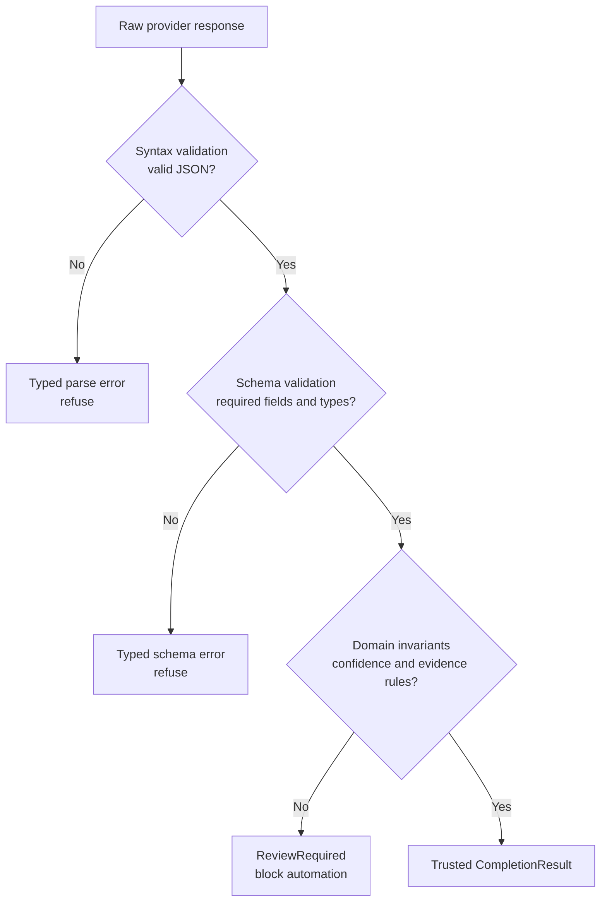
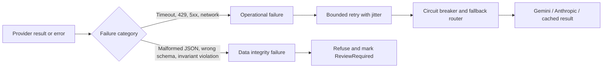
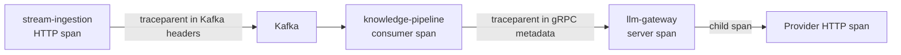
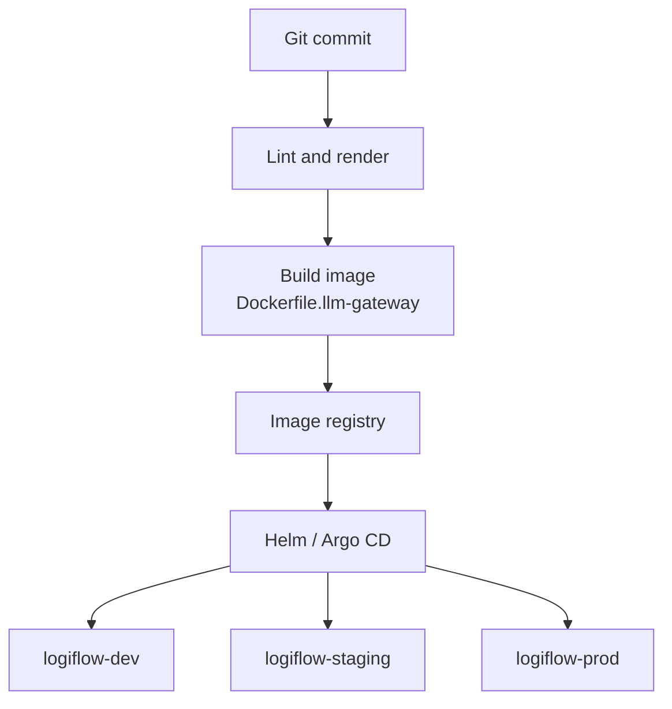

# LogiFlow LLM Gateway

The `llm-gateway` is the planned internal control plane for safe, provider-neutral AI execution in LogiFlow. It is a dedicated bounded context between internal services and external model providers such as OpenAI, Gemini, or Anthropic.

This document is the service-level high-level design (HLD). It describes the target architecture, the reasons for the major decisions, the runtime flows, operational trade-offs, and the implementation boundary between what exists today and what remains planned.

## Status And Scope

### Implemented

- A Go composition root at `cmd/llm-gateway/main.go`.
- An HTTP server listening on `PORT`, defaulting to `8080`.
- `GET /healthz`, `GET /startupz`, and `GET /live` health endpoints.
- Graceful shutdown on `SIGINT` and `SIGTERM`.
- A multi-stage Docker build at `build/Dockerfile.llm-gateway`.
- A Helm chart with platform labels, security contexts, resources, and probes.
- Development, staging, and production values overlays.
- A DDD directory skeleton under this service directory.

### Planned

The following capabilities are architectural targets described by this HLD and are not yet implemented by the current scaffold:

- gRPC request and response contracts.
- OpenAI, Gemini, and Anthropic provider adapters.
- Redis-backed tenant budgets, rate limiting, and semantic caching.
- Kafka `UsageCostEvent` publication and billing reconciliation.
- Schema and domain-invariant validation for structured model output.
- Circuit breaking, fallback routing, retries, and provider pools.
- W3C trace context propagation, metrics, and structured telemetry.

The distinction matters: the current process is deployable and probe-ready, but it is not yet an AI completion engine.

## Architectural Intent

The gateway owns the boundary around nondeterministic and failure-prone AI providers. Upstream services should depend on a stable LogiFlow contract rather than importing vendor SDKs or learning provider-specific failure semantics.



The central design rule is:

> AI output is untrusted until it passes syntax, schema, and business validation.

The gateway does not decide logistics policy such as whether a shipment is late. It guarantees that model output entering the platform is structurally valid, bounded by domain invariants, attributable to a tenant, and accompanied by operational metadata.

## Why A Dedicated Gateway

An alternative is to distribute a shared Go LLM client library across `stream-ingestion`, `knowledge-pipeline`, and future services. That approach is attractive for its simple local function calls, but it creates operational and architectural coupling.

| Decision           | Dedicated `llm-gateway` service                 | Shared Go library                                 |
| ------------------ | ----------------------------------------------- | ------------------------------------------------- |
| Deployment         | Provider policy can change independently        | Every importing service must rebuild and redeploy |
| Runtime isolation  | Slow provider calls are isolated from ingestion | LLM latency consumes resources inside each caller |
| Cost control       | One centralized tenant budget policy            | Duplicate and potentially divergent policies      |
| Provider migration | Switch adapters behind one contract             | Update every consumer and coordinate rollout      |
| Network cost       | gRPC serialization and network hop              | Nanosecond-scale local function call              |
| Failure handling   | One place for timeouts, breakers, and fallbacks | Repeated resilience implementations               |
| Scaling            | Scale AI execution independently                | Scale ingestion and AI workloads together         |

The gateway accepts the small cost of an internal gRPC hop in exchange for independent scaling, centralized governance, and isolation from slow or unreliable external providers. A library remains useful for shared data types and client stubs; it should not own the runtime provider policy in every service binary.

## Bounded Context And DDD Layers

The gateway bounded context is **Controlled, Safe, and Cost-Capped AI Execution**. Its domain model is not the entire logistics domain. It focuses on making external model behavior safe for logistics workflows.



### Domain Layer

Location: `services/llm-gateway/domain/`

The domain layer contains pure business concepts and rules. It must not import HTTP routers, gRPC libraries, Redis clients, Kafka clients, database drivers, or vendor SDKs.

The target model includes:

- `Request`: tenant identity, shipment or evidence identity, prompt version, model strategy, and input content.
- `CompletionResult`: trusted structured output plus provider and usage metadata.
- Typed failures such as validation, budget, timeout, provider, and review-required errors.
- Invariants such as `confidence` being in $[0.0, 1.0]$ and high-risk results requiring evidence in `reasons`.

### Application Layer

Location: `services/llm-gateway/application/`

The application layer orchestrates the completion use case without knowing concrete infrastructure. Ports should express capabilities rather than vendors:

- `Provider`: complete a request with a bounded context.
- `BudgetStore`: check and atomically reserve tenant budget.
- `CompletionCache`: read and write trusted cached results.
- `UsagePublisher`: publish usage events.
- `Clock` and telemetry ports for deterministic tests.

The application flow is deliberately ordered: identify tenant, enforce budget and rate limits, resolve cache, select a provider, apply a strict deadline, validate the response, record usage, and return a trusted result.

### Interfaces Layer

Location: `services/llm-gateway/interfaces/`

Adapters translate external transport contracts into application requests. The preferred synchronous contract for `knowledge-pipeline` is gRPC because the caller needs a typed request-response result before it can continue chunking and embedding.

HTTP remains useful for health checks and possible edge or operational endpoints. Kafka is an output or event boundary for usage and audit events, not a replacement for the synchronous completion call.

### Infrastructure Layer

Location: `services/llm-gateway/infrastructure/`

Infrastructure implements application ports:

- `provider/`: OpenAI, Gemini, and Anthropic HTTP adapters.
- `redis/`: budgets, distributed rate limits, circuit state where appropriate, and semantic cache.
- `kafka/`: durable usage event publication.
- `postgres/`: only when the gateway has a justified read or configuration need; the billing ledger remains authoritative elsewhere.
- `keycloak/`: authentication or service identity integration when required.

## End-To-End Request Flow



### 1. Tenant And Authorization Context

Every request must carry a tenant identity. The gateway must reject missing or malformed tenant context before it calls a provider. Tenant identity is also part of cache keys, rate-limit keys, usage events, and telemetry attributes.

Example key namespaces:

```text
tenant:{tenant_id}:budget
tenant:{tenant_id}:rate:{operation}
llm:cache:{tenant_id}:{prompt_version}:{request_hash}
```

Including tenant identity in cache keys prevents one customer's completion from being served to another customer. It is a correctness and compliance requirement, not merely a cache optimization.

### 2. Budget Enforcement And Usage Accounting

The hot path uses Redis because budget checks and atomic counters must be fast and shared across gateway replicas. A Lua script or equivalent atomic Redis operation should check and reserve budget without a read-then-write race.

The durable billing ledger is intentionally separate. The gateway emits a `UsageCostEvent` containing tenant, request, provider, model, token usage, estimated cost, and trace identifiers. The billing service consumes the event and writes the authoritative PostgreSQL transaction.

This is a write-behind design: low-latency enforcement happens in Redis, while durable accounting happens asynchronously.

### 3. Provider Selection

The application layer chooses a provider through a strategy or router. Upstream callers specify an intent or model policy, not vendor-specific request structures. Provider adapters translate the internal request into vendor APIs and normalize errors and responses back into gateway types.

## Structured Output Trust Pipeline



### Syntax Validation

Can the response be parsed as JSON? A malformed response is an operational or provider-contract failure and must not reach downstream business code.

### Schema Validation

Does the response have the required fields and types? The target risk contract includes:

- `shipment_id`: string identifying the logistics entity.
- `risk`: a controlled classification such as `high_risk`, `medium_risk`, or `no_risk`.
- `confidence`: numeric confidence score.
- `reasons`: structured evidence strings.

### Domain-Invariant Validation

Does the response make business sense? JSON can prove that `1.7` is a valid number, but only the domain rule can reject it because confidence must satisfy:

$$0.0 \leq \mathrm{confidence} \leq 1.0$$

Likewise, a `high_risk` result with an empty `reasons` array is structurally valid JSON but not an auditable business result.

The gateway must reject invalid output. It must not clamp `1.7` to `1.0` or invent a reason such as `Unknown`; silent repair hides model degradation and can trigger unsafe automation.

## Failure Policy: Fallback Versus Refusal



### Operational Failures: Fallback Is Safe

When a provider cannot be reached or returns a retryable operational response, the gateway has no model result to trust. It can retry within a strict budget or route to a configured fallback provider. Typical retryable cases include timeouts, HTTP 429, and selected HTTP 5xx responses.

### Semantic Failures: Refusal Is Safer

When a provider returns a response that is parseable but violates the domain contract, the model did answer and its answer is not trustworthy. Blindly retrying or falling back can waste budget and still produce a plausible but unsafe answer. The correct outcome is a typed refusal, an auditable `ReviewRequired` status, and human or workflow review.

## Timeouts And Goroutine Protection

Every outbound provider request must use a child `context.Context` with a short deadline, typically two to five seconds depending on the operation. Go cannot forcibly kill a goroutine; cancellation works because the HTTP client observes the context, closes the underlying request, returns an error, and allows the goroutine to exit naturally.

The timeout prevents a slow provider from accumulating unbounded in-flight work. It should be combined with:

- Maximum concurrent provider calls per instance.
- Bounded request body and response size limits.
- Retry budgets and exponential backoff with jitter.
- Queue or worker limits in asynchronous callers.
- Metrics for in-flight requests, timeout rate, and provider latency.

## Circuit Breaker And Fallback Design

```mermaid
stateDiagram-v2
	[*] --> Closed
	Closed --> Open: failure threshold reached
	Open --> HalfOpen: cooldown elapsed
	HalfOpen --> Closed: probe succeeds
	HalfOpen --> Open: probe fails
	Closed: Primary provider receives traffic
	Open: Primary blocked; fallback receives traffic
	HalfOpen: One or small number of recovery probes
```



The breaker is provider-scoped. One provider's outage must not disable healthy providers. A sliding window or consecutive-failure policy can open the circuit after a defined threshold, such as five timeout or server failures. After a cooldown, a single probe tests recovery.

Trade-offs:

- A low threshold protects resources quickly but may overreact to transient failures.
- A high threshold tolerates noise but spends more time and budget on a failing provider.
- Fallback improves availability but may change model behavior, cost, or output quality.
- A cached response improves latency and cost but can be stale; cache policy must be explicit and tenant-scoped.

Fallback routing applies to operational failures only. A fallback result must pass the exact same validation pipeline as a primary result.

## Rate Limiting And Provider Pools

The gateway should apply two layers of rate control:

1. A Redis-coordinated tenant token bucket protects LogiFlow resources and enforces fairness across replicas.
2. Provider-specific limits protect external quotas and can use a pool of authorized keys or accounts where policy and provider terms permit it.

A token bucket has capacity $C$ and refill rate $R$. The available tokens are replenished according to elapsed time, capped at $C$, and one token is atomically consumed per request. Redis Lua scripts are appropriate because the calculation and update must be one atomic operation.

Retries must not bypass the tenant or provider budget. A retry is another provider operation and must be accounted for or explicitly reserved.

## CAP And Redis Failure Policy

Budget enforcement is a financial and abuse-prevention invariant. The default posture should be CP-like and fail closed when the authoritative Redis write path is unavailable: return `codes.Unavailable` for unavailable state infrastructure or `codes.ResourceExhausted` when the budget is known to be exhausted.

An AP or fail-open strategy may be acceptable for non-critical semantic cache reads, where stale data is preferable to an error. It is dangerous for budget decrements because a tenant could exploit stale replicas during a partition and create unbounded provider spend.

Redis replicas are read-only in standard master-replica replication. The gateway must never assume that a replica can accept `DECRBY`, rate-limit increments, or other writes. If a business decision intentionally permits fail-open behavior, usage events must be durably buffered and reconciled later, with the financial risk explicitly accepted.

## Distributed Tracing And Telemetry



The W3C `traceparent` identifies the end-to-end trace. Each service creates its own span while preserving the trace ID. Kafka headers carry the context across the asynchronous boundary; gRPC metadata carries it across the synchronous boundary.

Tenant identity should be propagated as controlled baggage or a span attribute after authorization. It must not be copied into logs or traces without considering privacy and cardinality limits.

The gateway should record at least:

- `trace_id`, request ID, and tenant-safe correlation identifier.
- `model_provider`, model name, and prompt version.
- `provider_latency_ms`.
- `validation_latency_ms`.
- `total_gateway_latency_ms`.
- Input and output token counts and estimated cost.
- Cache hit or miss, retry count, breaker state, and final outcome.

These fields isolate vendor latency from internal validation time. For example, high `provider_latency_ms` with low `validation_latency_ms` indicates an external provider issue; the reverse indicates an internal processing bottleneck.

Telemetry should be exported asynchronously to systems designed for it, such as OpenTelemetry Collector, Prometheus, Tempo or Jaeger, and a log backend. High-frequency spans should not be written to the primary business PostgreSQL database.

## Communication Choices

### Why gRPC For Completion Requests

`knowledge-pipeline` needs a synchronous, typed result before it can continue processing a document. gRPC provides:

- Protobuf contracts and generated clients.
- Request-response semantics without building a request-reply queue.
- HTTP/2 multiplexing and deadlines.
- Standard status codes such as `codes.Unavailable` and `codes.ResourceExhausted`.

### Why Kafka For Usage Events

Usage accounting and billing reconciliation do not need to block the completion response. Kafka provides durable, replayable event delivery and allows billing to scale independently. Kafka is not used for the immediate completion response because a request-reply topic pair would introduce correlation, consumer lag, and rebalance complexity.

### Why Not Direct PostgreSQL On The Hot Path

Writing one billing row synchronously per completion introduces disk I/O, transaction locks, connection-pool pressure, and latency coupling. PostgreSQL remains the durable source of truth for billing, but Kafka and a billing consumer move that write off the model request path.

## Deployment Design

The service is packaged as a thin Helm chart at `deployment/helm/services/llm-gateway/` and inherits platform conventions from the `logiflow-service` library chart.



The container contract is:

- Listen on `PORT`, default `8080`.
- Respond to `GET /healthz`, `GET /startupz`, and `GET /live`.
- Run as a non-root user with the library chart's security context.
- Use explicit resource requests and limits.
- Keep production secret values outside commits and inject them through the deployment secret mechanism.

### Local Build And Deployment

```bash
docker build -f build/Dockerfile.llm-gateway -t logiflow/llm-gateway:local .
kind load docker-image logiflow/llm-gateway:local --name logiflow-dev
helm lint deployment/helm/services/llm-gateway --namespace logiflow
helm upgrade --install llm-gateway-dev deployment/helm/services/llm-gateway \
  -f deployment/helm/services/llm-gateway/values-dev.yaml \
  --set image.tag=local \
  --namespace logiflow-dev --create-namespace
kubectl get pods -n logiflow-dev
```

For a local Kind cluster, staging and production should use the locally loaded image explicitly. Real environments should use immutable registry tags and never rely on the local `:local` tag.

## Security And Safety Decisions

- Treat model output as hostile input until validated.
- Never expose provider API keys to upstream services.
- Keep provider credentials in Kubernetes secrets or an external secret manager.
- Include tenant identity in authorization, budget, cache, event, and trace decisions.
- Do not log prompts, completions, or credentials by default; redact sensitive content.
- Enforce response size limits to prevent memory exhaustion.
- Use TLS and authenticated service identity for production gRPC traffic.
- Apply least privilege to Redis, Kafka, provider, and secret-manager clients.
- Preserve refusal and validation failures as auditable outcomes rather than silently repairing them.

## Testing Strategy

The service should build confidence from the inside out:

1. Domain unit tests for confidence bounds, risk/reasons invariants, and typed errors.
2. Application tests using fake provider, budget, cache, and publisher ports.
3. Provider contract tests for normalized success, timeout, 429, 5xx, malformed, and oversized responses.
4. Resilience tests for breaker transitions, fallback routing, retry budgets, and cancellation.
5. Integration tests for Redis atomic scripts and Kafka event publication.
6. Helm lint and render tests for every environment overlay.
7. Kind smoke tests that wait for readiness and call all health endpoints.
8. Load tests measuring concurrency limits, provider latency, cache behavior, and budget race safety.

## Decision Summary

| Concern               | Chosen approach                                  | Why                                                     | Cost or risk                                       |
| --------------------- | ------------------------------------------------ | ------------------------------------------------------- | -------------------------------------------------- |
| Service boundary      | Dedicated gateway                                | Independent scaling and centralized AI governance       | Internal network hop and another deployable        |
| Synchronous protocol  | gRPC                                             | Typed, deadline-aware request-response contract         | Requires protobuf lifecycle and service discovery  |
| Usage durability      | Redis hot path plus Kafka write-behind           | Protects latency while preserving replayable accounting | Eventual consistency and operational dependencies  |
| Financial correctness | Fail closed when budget authority is unavailable | Prevents runaway spend                                  | Temporary unavailability during state-store outage |
| Provider resilience   | Timeout, retry, circuit breaker, fallback        | Contains external failures                              | Fallback may change cost or model quality          |
| Output safety         | Syntax, schema, domain validation                | Blocks plausible but unsafe AI output                   | Some valid-looking results require human review    |
| Cache                 | Tenant-scoped semantic cache                     | Reduces cost and latency                                | Staleness, invalidation, and privacy risk          |
| Telemetry             | W3C tracing and asynchronous export              | Diagnoses cross-service latency                         | Instrumentation and storage overhead               |

## Implementation Roadmap

1. Define protobuf completion and error contracts.
2. Complete the domain model and validation policy tests.
3. Implement the application completion use case and ports.
4. Add provider adapters with strict context deadlines.
5. Add Redis budget reservation, rate limiting, and cache behavior.
6. Add provider routing, circuit breaking, fallback, and bounded retries.
7. Add Kafka usage events and billing reconciliation contract.
8. Add tracing, metrics, structured logs, and latency metadata.
9. Add integration, load, security, and failure-injection tests.
10. Promote immutable images through dev, staging, and production via GitOps.

## References

- [Root platform README](../../README.md)
- [Service generation runbook](../../docs/runbooks/generate-service.md)
- [Platform engineer runbook](../../docs/runbooks/runbook-platform-engineer.md)
- [Debug playbook](../../docs/runbooks/debug-playbook.md)
- [LLM gateway HLD source document](LogiFlow_%20LLM_GATEWAY_HLD.pdf)
